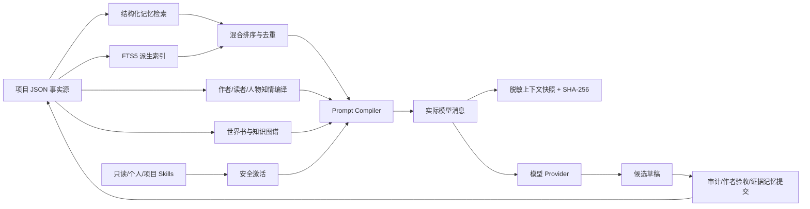

# InkForge Local 0.20 最终优化实现工程报告

日期：2026-08-30  
实现版本：0.20.0  
API Schema：36  
Memory State：4

## 1. 执行结论

本轮不是继续堆提示词，而是把长篇小说系统最容易失控的四个基础能力做成可测试的工程组件：

1. **旧正文可以被精确找回**：SQLite FTS5 负责召回很久以前、未必进入摘要的正文细节；结构化事实、时间线、人物状态和伏笔仍是权威层。
2. **模型不会把“作者知道”误当成“人物知道”**：作者真相、读者已见和人物有证据知情分层编译，并按章节号阻止未来知识倒灌。
3. **每次生成都可以复盘**：实际发送给模型的消息、记忆来源、世界书、Skill 和预算裁剪会冻结为快照，并生成内容哈希。
4. **写作方法可以模块化但没有执行权限**：内置、个人和项目 Skills 只允许提供提示词方法，不能执行命令、访问文件、联网或覆盖事实层。

这四项把“让模型记住小说”从一个模糊目标拆成了四个可验证问题：**存什么、何时可见、为什么被召回、当时到底发送了什么**。

本轮完整本地回归结果为 **183 passed**；正式数据库完整性检查为 `ok`，FTS5 已启用并从现有项目重建派生索引。迁移前已生成独立 SQLite 备份。

## 2. 目标架构



核心原则没有改变：`projects.payload` 中的项目 JSON 是唯一事实源。FTS、知识图谱和快照都是投影或审计记录，不能反向静默改写人物、世界观或正文。

## 3. FTS5 混合长期记忆

### 3.1 为什么原有检索不够

旧版依赖无关词法检索能够从摘要、事实、伏笔、时间线和关系中选取相关项，但有一个明确盲区：作者在第 4 章写过一个具体动作或道具细节，如果记忆提取没有把它升级为事实，写到第 40 章时就只能依赖摘要是否碰巧保留它。

0.20 为每个已保存项目建立 `search_documents_fts`，索引对象包括：

- 章节摘要；
- 约 900 字、带重叠窗口的旧章节正文片段；
- 有效事实及标签；
- 未关闭伏笔及相关人物；
- 时间线事件；
- 动态关系；
- 人物有来源知情账本。

中文检索额外生成稳定双字词元，Latin/数字使用标准词元。这样不需要引入向量数据库或外部 embedding 服务，部署仍保持单机 SQLite。

### 3.2 时间与事实边界

`search_project()` 在 SQL 层执行三类过滤：

- `chapter_number < current_chapter_number`：当前章和未来章正文不能成为历史记忆；
- `valid_from <= current`：尚未生效的事实不能注入；
- `valid_until >= current`：已经失效的事实不能继续作为现状。

FTS 结果进入 `retrieve_memories()` 后，与结构化命中共同参加相关性重排、类型配额和 MMR 式近重复抑制。旧正文片段设有独立配额，防止全文召回挤走高权重事实。

### 3.3 生命周期与降级

- 创建、保存、导入和恢复项目：同一事务内替换该项目索引。
- 删除项目：同步删除索引状态和文档。
- 应用升级：比较项目 `updated_at` 与 `search_index_state`，只重建缺失或过期索引。
- 手工修复：`rebuild_search_index()` 可对单个或全部项目重建。
- SQLite 构建没有 FTS5：应用自动切换 `lexical_fallback`，核心写作不被阻断。

该设计避免了双写事实源：索引可以删掉再建，手稿和设定不会丢失。

## 4. 作者、读者与人物知情边界

### 4.1 数据模型

事实新增：

- `known_by`：明确知道该事实的人物名；
- `reader_known`：读者是否已从被接受正文中看到；
- `author_only`：仅作者/系统层可用，不可自动向读者或人物揭示。

人物知识拆为：

- `knowledge_baseline`：开篇或人工维护的初始知识；
- `knowledge_ledger`：带 `source_chapter_id`、`chapter_number`、`learned_how`、`certainty` 和正文证据的增量知识。

记忆结算不再把新增知识字符串追加回人物 `knowledge`。旧项目迁移时，会从已有 `knowledge` 中剔除与账本完全相同的增量条目，尽可能恢复基线；无法从旧数据确定的部分保守保留，不做猜测性删除。

### 4.2 提示词编译规则

生成第 N 章时：

- 只有章号为 0 的手工基线或早于 N 的账本记录可作为人物行动依据；
- N 章及之后的知情记录被排除；
- `suspected` 只能作为人物猜测；
- 读者已见事实可以制造戏剧反讽，但不能自动升级成人物知识；
- private / author_only 事实若未在 `known_by` 明示当前人物，会进入“明确不可知/不可据此行动”；
- 其他人物 `secrets` 默认不可知。

这个边界同时进入正文 Prompt、章节规划和连续性审计，而不是只在最终审校时补救。

## 5. 可冻结、可审计、可回放的上下文快照

### 5.1 快照内容

`context_snapshots` 保存：

- 生成模式、作者临时指令、选区、目标字数和手动 Skill ID；
- 实际发送给模型的 system/user messages；
- 每个上下文区块是否发送、裁剪前后 token、裁剪原因和优先级；
- 激活世界书及触发原因；
- 检索记忆的 kind、source_id、origin、内容和分数；
- 激活 Skill 的范围、模式和原因；
- 非敏感 Provider/模型运行信息；
- 对冻结 messages 计算的 SHA-256。

生成接口在调用 Provider 前自动写快照，并在 SSE meta 中返回 `context_snapshot_id` 和 `prompt_hash`。提示词预览也提供手工冻结入口。

### 5.2 回放语义

回放使用快照中的冻结 messages，不重新运行检索、世界书激活或预算裁剪；调用方另行提供当前模型设置。这样可以比较：

- 同一个提示词在不同模型上的表现；
- 同一模型不同采样参数的差异；
- 项目后来修改后，旧生成为什么会得到当时的结果。

“回放”不是复制旧项目状态重新编译，因此它具有明确、稳定的审计语义。

### 5.3 密钥安全

快照不会接收整个项目对象，只提取生成必需字段。写入前还会递归处理：

- `api_key`、`authorization`、`access_token`、`refresh_token`、`secret_key`、`password` 等键统一替换为 `[REDACTED]`；
- 字符串中的疑似 `sk-` / `rk-` / `pk-` 密钥和 Bearer Token 统一脱敏；
- 回放请求里的 Provider 凭据只存在于当次请求内，不回写快照。

每项目默认只保留最近 60 份快照，上限受控；删除项目会同步清理快照。

## 6. 安全写作 Skills

### 6.1 三种范围

| 范围 | 存储位置 | 用途 | 权限 |
|---|---|---|---|
| builtin | 代码常量 | 经测试的通用写作方法 | 只读 |
| user | SQLite `user_writing_skills` | 本机所有作品复用 | 可增删改 |
| project | 项目 JSON `writing_skills` | 随作品导出、导入 | 可增删改 |

内置 Skills 包含连续性与因果链、对白与潜台词、悬疑公平性、动作清晰度和情绪转折落地。

### 6.2 激活

- `always`：每次任务激活；
- `auto`：按关键词、任务类型或足够高的文本相关性激活；
- `manual`：仅当 `skill_ids` 或项目 `writing_skill_preferences.manual_ids` 明示时激活。

激活数量有上限，Prompt 中会记录范围与原因。Skills 区块的优先级低于事实、知情、世界规则和章节契约，并明确声明不得覆盖这些权威层。

### 6.3 能力白名单

这是“写作方法模块”，不是任意 Agent 执行插件。标准化器只授予 `prompt_instructions`；如果条目声明 `script`、`command`、`tool`、`path`、`url`、`network`、`filesystem`、`shell` 等字段会直接拒绝。疑似 API Key 也不能保存进 Skill。

非 builtin 条目不能使用 `builtin-` ID，因此不能覆盖只读内置 Skill。

## 7. API 与界面

新增主要接口：

- `POST /api/search`：带章节边界的 FTS 检索诊断；
- `POST /api/prompt/snapshot`：手动冻结当前 Prompt；
- `GET /api/projects/{id}/context-snapshots`：列出快照；
- `GET /api/prompt/snapshots/{id}`：读取完整冻结内容；
- `POST /api/prompt/snapshots/{id}/replay`：以新设置流式回放；
- `GET /api/writing-skills`：合并列出三层 Skills 与权限；
- 个人、项目 Skills 的新增/更新/删除接口。

前端新增：

- 故事圣经中的“写作 Skills”管理入口；
- 手动 Skill 的项目默认启用；
- 右侧本次上下文的 Skill 徽标；
- 提示词预览中的 FTS/lexical 来源、Skill 激活原因；
- 手工冻结、快照历史、完整冻结消息与来源审计。

## 8. 关键文件与后续学习修改入口

| 文件 | 本轮职责 | 适合继续修改的地方 |
|---|---|---|
| `app/db.py` | FTS 文档编译、索引生命周期、快照、个人 Skills、Schema 4 迁移 | 分词、正文 chunk 大小、快照保留数、索引文档类型 |
| `app/memory.py` | 结构化/FTS 混合排序、类型配额、近重复抑制 | 不同 kind 权重、MMR 惩罚、召回上限 |
| `app/prompts.py` | 检索查询、知情边界、Skill 激活、Context Compiler | 区块优先级、预算、不同题材的边界表达 |
| `app/writing_skills.py` | Skill Schema、内置方法、安全校验和激活 | 新增经测试的题材 Skill、关键词和任务路由 |
| `app/main.py` | API、生成自动快照、回放、检索/Skills 注入 | 快照对比、评测编排、管理接口 |
| `static/app.js` | Skills 管理、快照审计、检索来源显示 | 快照差异 UI、Skill 编辑体验、搜索诊断面板 |
| `tests/test_search_index.py` | FTS 时间边界和生命周期 | 长文压力、混合查询质量 |
| `tests/test_epistemic_boundaries.py` | 人物未来知识隔离 | 多视角、全知叙述、传闻传播 |
| `tests/test_context_snapshots.py` | 脱敏、保留、清理和回放 | 哈希对比、并发生成 |
| `tests/test_writing_skills.py` | 激活、只读和权限拒绝 | Skill 冲突、版本迁移 |

建议修改顺序：先新增失败测试，再调整 `writing_skills.py` / `memory.py` 的纯函数，最后修改 Prompt 区块。不要直接把更多内容设成常驻 required；长篇质量常见问题不是信息太少，而是重要信息被低价值上下文淹没。

## 9. 验证结果

自动化测试：

```text
183 passed in 7.73s
```

覆盖的本轮关键不变量：

- FTS 能从旧正文找回未进入摘要的细节；
- 当前章和未来章不能被召回；
- 保存替换旧索引，删除项目清理索引；
- 事实有效期生效，重建索引不修改项目 JSON；
- 旧库自动迁移并重建；
- 本章知识不会倒灌本章 Prompt；
- reader/private/known_by 分层可见；
- 快照不落凭据、按上限轮换、随项目删除；
- 回放使用冻结 messages；
- 内置 Skill 不可覆盖，自定义 Skill 无执行权限；
- 原有自动导演、孵化、规划、记忆、Canon、知识图谱、Provider、前端绑定全部回归通过。

正式数据库检查：

```text
PRAGMA integrity_check = ok
FTS5 = enabled
```

## 10. 发布判断与剩余工作

0.20 已达到“可交付候选版”的本地工程标准，但要称为公开正式版，仍建议完成以下发布门：

1. 使用有效的 SiliconFlow 凭据在新版本上重新执行真实 Cloud Full E2E；本地测试不能替代 Provider 实际可用性。
2. 用至少一部 30—60 章、每章 1500—3000 字的测试小说做 FTS 召回人工评测，建立 Recall@K、错误未来泄漏率和无关片段率。
3. 增加人物知识传播操作：把某条事实显式授予/撤销某个人物，而不依赖下一次记忆提取。
4. 增加快照 diff：对比两次生成时哪些事实、世界书、Skill 或预算状态发生改变。
5. 为高风险数据库迁移增加独立离线迁移命令和升级回滚演练。
6. 做浏览器人工验收：窄屏、长 Prompt、60 个快照、100 个自定义 Skill、自动导演运行中并发操作。

这些是下一阶段的可测工程项，不需要再通过扩大单次提示词来解决。

## 11. 最终结论

当前项目已经从“结构化提示词写作工具”进一步成为一个具备**全文片段检索、认识论边界、上下文可追溯性和安全方法模块**的长篇生产系统。它仍不能保证模型永远不犯文学或事实错误，但现在错误可以被限制、解释、回放和测试；这正是从个人原型走向专业发布所需要的基础。

