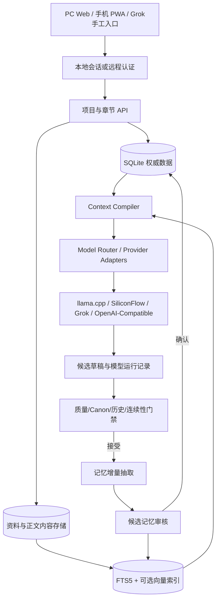

# InkForge、Grok、GoInk、InkOS、NovelAI 与 Agent Skills 长篇记忆工程分析报告

**报告日期：** 2026-08-29  
**分析对象 A（当前工作区）：** `C:\Users\16708\Documents\Codex\2026-07-29\gei-w\outputs\inkforge-local`  
**分析对象 B（用户上传版）：** `D:\桌面\inkforge-local-refactored-v0.18.1-cloudqa-r3\inkforge-local-0.18.1`  
**外部对照：** GoInk、InkOS、NovelAI 官方产品、AI-Team-Team/AI-Novel、Agent 写作 Skills  
**报告性质：** 代码审计、版本比较、真实 QA 复核、长篇记忆架构评估、Grok/手机使用方案、外部项目源码对照与逐文件实施路线设计

---

## 1. 执行摘要

### 1.1 最重要的结论

1. **上传版是当前版的明确后续演进，不是另一套互不相关的项目。** 当前工作区为 `v0.16.0`，上传版为 `v0.18.1`。上传版保留了当前版的规划、世界书、长期记忆、文风、全稿质量和自动导演主干，在此基础上增加了 Provider 抽象、多文件参考资料、Canon Lock、结构化知识投影、文件解析与更完整的云端 QA。

2. **上传版明显优于当前版，应作为后续主线，但不能直接覆盖当前目录或数据库。** 当前数据库约 78 MB，包含 2 个项目、58 个全项目历史版本、203 个章节版本和 1 个导演任务。升级必须采用“备份—副本迁移—回归验证—切换”的方式，不能把上传包的空数据库覆盖现有数据。

3. **“让模型记住小说”不能依赖模型本身或一个永远不关闭的聊天窗口。** 正确做法是把记忆外置成可持久化、可检索、可审计的数据系统：权威设定、人物状态、人物知情、事实、关系、事件、伏笔、章节结算和资料索引都存于应用层；每次生成前编译相关工作集，每章接受后再做证据化增量回写。当前版已经实现了这一思想的大部分骨架，上传版又补上了 Canon 与知识层。

4. **上传版的“证据记忆”仍是部分实现，而不是完全闭环。** 代码会验证一部分人物、事实、关系和描写证据，但证据缺失时仍允许若干记忆作为已确认状态写入；时间线没有逐条证据校验；`story_so_far` 直接接受模型重写；章节抽取出的普通 `facts` 并没有自动投影到新知识图谱，知识投影当前主要覆盖人物当前位置/状态与关系。因此 README 所描述的“所有硬记忆均有证据”比实际代码更理想化。

5. **上传版 `0.18.1` 还不能称为已经通过真实云端最终验收。** 包内真实 SiliconFlow 报告实际针对 `0.18.0`，总结果为 `FAIL`：短稿补写重复、章节记忆退化、灵感孵化失败、三章自动导演暂停。`0.18.1` 对这四项进行了代码修复和本地回归，但包内报告明确写着“必须再运行一次真实 Cloud Full E2E 才能标记最终完成”。历史对话中后来还出现过 `0.18.2` 的四级记忆恢复方案，但这次上传的代码不包含该版本，不能把历史对话中的结果当成本次代码证据。

6. **Grok 可以以两种方式参与：**

   - 立即可用：直接在 Grok 手机 App 中按“资料分层—先策划—逐章生成—定期状态存档”的手工流程写作。
   - 产品化：把 Grok/xAI 作为 InkForge 的一个 Provider，由 InkForge 管理记忆、检索、审计与章节状态。xAI 官方 API 当前兼容 OpenAI REST 形式，上传版的通用 OpenAI-Compatible 通道在协议形态上可以接入 `https://api.x.ai/v1`，但项目没有 Grok 专用预设、`XAI_API_KEY` 适配、Responses API、Files/Collections 或真实 xAI E2E，因此只能评价为“理论可接，尚未验收”。

7. **手机访问 InkForge 与“在手机 Grok App 里写”是两个不同问题。** 当前 `run.ps1` 只监听 `127.0.0.1`，手机无法直接访问；前端虽有基础移动端媒体查询，但没有登录、TLS、远程同步或 PWA 离线能力。绝不能为了手机访问就直接把现有无认证 API 暴露到公网。

### 1.2 建议决策

**建议以上传版 `0.18.1` 为代码迁移基线，但把下面四项作为合并前 P0：**

1. 先把现有 78 MB 数据库复制备份并做迁移演练；
2. 补齐严格证据门禁和 `facts → knowledge` 投影；
3. 合入历史对话中 `0.18.2` 的“完整 AI → 精简 AI → 最小事实 AI → 本地保底”四级恢复思路；
4. 在真实 Provider 上重跑 Cloud QA，再决定是否作为稳定版。

如果短期目标只是“现在就用手机写 4～5 万字同人小说”，最省事的路径仍然是 Grok App 手工工作流；如果目标是长期稳定写多本、几十万字、跨设备且可追溯，应该继续建设 InkForge，而不是依赖一个聊天窗口。

---

## 2. 分析方法与证据等级

本报告刻意区分以下四类信息：

| 等级 | 含义 | 本报告中的用法 |
| --- | --- | --- |
| A：直接验证 | 代码、数据库、命令或测试在本机直接核验 | 作为确定事实 |
| B：项目材料声明 | README、CHANGELOG、QA 报告、研究文档中的自述 | 与代码/测试交叉验证后采用 |
| C：历史对话记录 | 此前关于 Grok、手机写作、0.18.2 的讨论 | 作为需求与设计沿革，不冒充当前代码 |
| D：外部官方文档 | OpenAI/xAI 官方 API 或产品文档 | 用于判断当前产品能力和未来集成方向 |

项目内 Markdown 文件只被当作项目材料，没有把其中的描述或指令当作本次用户命令执行。

### 2.1 本机验证摘要

| 项目 | 当前工作区 | 上传版 |
| --- | ---: | ---: |
| 应用版本 | 0.16.0 | 0.18.1 |
| Python 应用模块 | 12 | 17 |
| FastAPI 路由装饰器 | 33 | 41 |
| `app/main.py` 实际行数 | 4,104 | 4,666 |
| `static/app.js` 实际行数 | 1,195 | 1,343 |
| 测试文件 | 16 | 28 |
| 测试函数 | 103 | 157 |
| 本机测试 | 103/103 通过 | 156 通过，1 项因复用旧环境缺少 `pypdf` 失败 |
| Python 编译 | 通过 | 通过 |
| JavaScript 语法检查 | 通过 | 通过 |

上传版 `requirements.txt` 已新增 `pypdf==6.0.0`。失败的 PDF 解析测试是因为本次复用了当前版旧虚拟环境，而当前版依赖没有 `pypdf`；上传版启动脚本会根据 requirements 哈希重新安装依赖。因此这是一条真实的**升级环境要求**，不是 PDF 解析断言本身失败。

---

## 3. 两个项目的真实关系与差异

### 3.1 共同主干

以下模块在两版之间文件哈希完全相同：

- `memory.py`：长期记忆检索、伏笔/暗线议程；
- `planning.py`：全书、分卷、章节规划；
- `lore.py`：关键词/正则/条件/递归世界书；
- `style_engine.py`：风格统计、样例选择；
- `manuscript_quality.py`：跨章和全稿质量；
- `fallbacks.py`：模型失败时的本地降级。

这说明上传版没有推翻当前版记忆骨架，而是围绕它增加了“资料来源治理、原作正典、知识投影和 Provider”。

### 3.2 上传版新增模块

| 模块 | 作用 | 专业价值 | 当前局限 |
| --- | --- | --- | --- |
| `providers.py` | 区分 SiliconFlow、llama.cpp、通用 OpenAI-Compatible | 模型与业务解耦，可切云/本地 | 能力注册仍较简单；没有 Grok/OpenAI Responses 专用适配 |
| `references.py` | 参考资料分类、分块、相关检索、样文重合检测 | 分离“怎么写”和“写谁” | 仍是字符/词法检索；所有原文保存在项目 JSON 中 |
| `file_parsing.py` | TXT/MD/HTML/DOCX/EPUB/PDF 解析 | 手机资料导入门槛显著降低 | ZIP 解压规模未限制；扫描 PDF/OCR 不支持 |
| `canon.py` | 同人角色 Canon Profile、OOC 审校提示与上下文 | 对狂三、花火、绘梨衣等原作角色非常必要 | 正典档案依赖人工核对；接受门禁可被“仅插入正文”绕过 |
| `knowledge.py` | 实体、事实、关系、状态 superseded、图谱快照 | 把图谱定位为可重建检索投影，方向正确 | 自动投影范围窄；候选审核面板不完整；非语义检索 |

### 3.3 关键改动

上传版还修改了：

- `db.py`：新增 Provider、参考资料、Fanfic、Knowledge 默认字段和迁移；
- `llama_client.py`：通过 Provider 层构建请求、读取环境变量密钥、解析 SSE；
- `prompts.py`：在上下文编译中加入 Canon、Knowledge、Reference，并修复长正文输出预算与选区重写尺度；
- `quality.py`：增加权威上下文支持，降低历史“新增往事”误报；
- `main.py`：新增资料解析、综合文风、Canon 分析/审计、知识图谱、Provider 信息、短稿自动补足、记忆精简恢复等端点和流程；
- `static`：增加资料库、Canon、知识图谱、Provider UI 与接受前 Canon Gate。

### 3.4 版本演进判断

| 维度 | 当前 v0.16 | 上传 v0.18.1 | 判断 |
| --- | --- | --- | --- |
| 本地长篇规划 | 完整 | 基本相同 | 已较成熟 |
| 结构化长期记忆 | 有 | 核心相同 | 架构好，证据门禁需加强 |
| 原作同人支持 | 无专门层 | Canon Lock + OOC 审校 | 显著升级 |
| 多资料导入 | 单样文为主 | 多格式、多类别 | 显著升级 |
| 模型接入 | llama.cpp 偏置 | SiliconFlow/本地/通用兼容 | 显著升级 |
| 语义检索 | 无 | 仍无 | 主要短板未解决 |
| 手机体验 | 基础响应式 | 略增强 | 仍不是移动产品 |
| 可维护性 | 后端/前端单体 | 单体继续增大 | 反而变差 |
| 云端真实验证 | 无 | 有首轮证据 | 0.18.1 修复尚未复验 |

---

## 4. 当前系统如何“记住小说”

### 4.1 记忆不是一个字段，而是一条闭环

上传版的主链路可概括为：


这比“把前 5 万字全部塞给模型”专业得多。模型每次只看到本章需要的工作集，而真实记忆保存在应用中。

### 4.2 已实现的记忆层

#### 权威作者层

- 作者意图；
- 本书硬规则；
- 故事总纲和分层规划；
- 当前章节计划；
- 人物核心、稳定外貌、价值观、语言、硬限制；
- 人工核对 Canon Profile；
- 世界书 hard canon。

#### 动态叙事层

- `story_so_far` 滚动全书进展；
- 章节摘要；
- 人物当前状态、位置、持有物、情绪、可变外观；
- 人物知情账本；
- 原子事实与有效期；
- 动态关系；
- 时间线；
- 伏笔/暗线生命周期；
- 连续性备注；
- 描写去重复账本；
- 每章 `settlement` 结算单。

#### 检索投影层

- 实体索引；
- 知识事实；
- 关系邻域；
- 图谱快照；
- 参考资料分块；
- 当前相关记忆集合。

### 4.3 上下文编译是本项目最有价值的部分

上传版 `build_prompt` 会先用本次指令、选区、场景目标、章节计划、分层规划和最近正文形成查询；再依次选择伏笔议程、活跃人物、知识关系、Canon、参考资料、世界书、长期记忆和最近章节摘要。各区块带优先级、是否必需、最小保留量和尾部保留策略；最后从上下文窗口中预留输出空间并裁剪低优先级区块。实现可见 [prompts.py](<D:/桌面/inkforge-local-refactored-v0.18.1-cloudqa-r3/inkforge-local-0.18.1/app/prompts.py:801>)。

这一设计解决了三类常见问题：

1. 不是每章灌入所有设定；
2. 不让参考样文或旧摘要挤掉当前硬规则；
3. 预留真实生成空间，降低 llama.cpp 或云模型因上下文耗尽而截断。

### 4.4 检索算法的现实能力

当前长期记忆和资料检索基于中文单字、双字片段、拉丁词的词法重合与手工权重，见 [memory.py](<D:/桌面/inkforge-local-refactored-v0.18.1-cloudqa-r3/inkforge-local-0.18.1/app/memory.py:239>)、[references.py](<D:/桌面/inkforge-local-refactored-v0.18.1-cloudqa-r3/inkforge-local-0.18.1/app/references.py:66>)。它具有以下特点：

- 人名、地名、专有名词和原句附近召回通常有效；
- 无额外服务，适合本地、便携、零安装；
- 类型配额和近重复抑制能避免全被章节摘要或旧事实占满；
- 对同义改写、隐含因果、跨语言别名和“没有共享字面词但语义相关”的内容召回较弱；
- 中文单字重合容易产生噪声。

因此它适合 4～20 万字的早期本地项目，但不是高质量语义记忆的终点。

---

## 5. 记忆完整性审计：文档承诺与代码现实

### 5.1 做得好的地方

1. **候选正文不自动覆盖已确认正文。**
2. **接受正文后才回写记忆。**
3. **人物名称必须匹配已有角色，未知人物状态不自动写入。**
4. **当模型提供 evidence 时，会做去标点/空白后的正文包含核验。**
5. **事实支持有效期和 `supersedes_id`，可关闭旧状态。**
6. **伏笔没有可验证 payoff 时不能直接关闭，会降为 progressing。**
7. **描写账本只接收能在正文中找到的显著措辞。**
8. **知识图谱被定义为可重建投影，而不是唯一真相源。**

### 5.2 必须正视的缺口

#### 缺口 A：证据是“有则验证”，不是“无证据不准写”

`_verified_evidence` 在 evidence 为空时返回 `("", False)`；调用侧只有在“evidence 非空但未验证”时才跳过。因此人物状态、普通事实和关系更新在 evidence 为空时仍可能进入主记忆。见 [main.py](<D:/桌面/inkforge-local-refactored-v0.18.1-cloudqa-r3/inkforge-local-0.18.1/app/main.py:3546>) 与 [main.py](<D:/桌面/inkforge-local-refactored-v0.18.1-cloudqa-r3/inkforge-local-0.18.1/app/main.py:3673>)。

**影响：** 小模型漏字段时不会整份失败，但模型幻觉也可能成为“confirmed”记忆。

**建议：**

- `confirmed` 必须 `evidence_verified=true` 或 `source_type=author/manual/canon`；
- 无 evidence 的模型抽取只能进入 `candidate`；
- UI 增加候选记忆审核队列；
- 兼容旧数据时标记 `legacy_unverified`，不要继续伪装成严格确认。

#### 缺口 B：时间线没有逐条证据校验

时间线事件直接由模型结果写入，仅按 `time|event` 去重，没有 evidence 验证。

**建议：** 为每个 event 增加 `evidence`、`source_chapter_id`、`status`；没有证据就进入候选事件，不能作为后续硬时间线。

#### 缺口 C：`story_so_far` 是模型改写结果

`story_so_far` 被截到 4,000 字后直接覆盖。它适合做检索/叙事摘要，但不能作为事实权威，因为摘要模型可能遗漏否定、混淆人物或错误归因。

**建议：** 明确分成：

- `story_so_far`：软摘要，可重建；
- `confirmed_facts/events/states`：硬状态；
- `chapter_settlements`：逐章不可变增量。

#### 缺口 D：记忆 facts 没有完整投影到知识 facts

`project_accepted_memory_to_knowledge` 目前自动处理人物当前位置/状态和关系，未遍历 `result["facts"]`，见 [knowledge.py](<D:/桌面/inkforge-local-refactored-v0.18.1-cloudqa-r3/inkforge-local-0.18.1/app/knowledge.py:565>)。所以旧 `memory.facts` 与新 `knowledge.facts` 仍是两套没有完全打通的事实系统。

**建议：**

- 统一事实 ID 与来源；
- 将经过证据核验的 memory fact 映射为 subject/predicate/object；
- 无法稳定结构化时保留 text fact，但仍共享来源与状态；
- 设置明确的主真相源，避免两个 facts 列表互相冲突。

#### 缺口 E：Canon Gate 可被“仅插入正文”绕过

前端“接受并更新记忆”会先执行 Canon Gate，但“插入正文”按钮会直接把草稿插入编辑器，不执行门禁，也不更新记忆，见 [app.js](<D:/桌面/inkforge-local-refactored-v0.18.1-cloudqa-r3/inkforge-local-0.18.1/static/app.js:390>) 和 [app.js](<D:/桌面/inkforge-local-refactored-v0.18.1-cloudqa-r3/inkforge-local-0.18.1/static/app.js:998>)。

这对“作者最终控制”是合理逃生口，但 UI 必须明确：

- “仅插入未验收草稿”；
- 该章处于 `draft/unaccepted` 状态；
- 未验收正文不得成为后续硬记忆；
- 作者可显式“强制接受”，并留下审计记录，而不是静默绕过。

---

## 6. 真实 QA 结论

### 6.1 已经真实证明的能力

包内 `0.18.0` 真实 SiliconFlow 测试证明下列链路至少在一次联网 Windows 环境中实际跑通，而非纯 mock：

- 模型列表、普通聊天、JSON、SSE、关闭思考；
- 多样本文风分析；
- 世界书激活；
- 章节规划与两章历史正文；
- 跨章摘要召回；
- 重写与扩写；
- Canon Profile、Canon Lock、OOC 审校；
- 全书分层规划。

### 6.2 尚未真实证明的 `0.18.1` 修复

首轮报告的总结果是 `FAIL`：

1. 自动补写造成结尾循环；
2. 章节记忆退回本地摘要且 `facts=0`；
3. 12 章灵感孵化因固定长篇阈值失败；
4. 3 章自动导演因故事骨架阈值暂停。

`0.18.1` 已添加针对性代码和测试，但包内没有修复后的真实 SiliconFlow 第二轮通过证据。项目自己的 [REAL_SILICONFLOW_QA_REVIEW_20260823.md](<D:/桌面/inkforge-local-refactored-v0.18.1-cloudqa-r3/inkforge-local-0.18.1/REAL_SILICONFLOW_QA_REVIEW_20260823.md>) 也明确把下一轮真实 QA 列为必要条件。

### 6.3 历史对话里的 `0.18.2`

历史对话记录显示后来提出/生成过以下方向：

- 完整 AI → 精简 AI → 最小事实 AI → 本地保底；
- 灵感孵化两套方案拆成两次调用；
- 更强的相似句边界去重；
- 历史人物来源边界与称谓禁用词；
- 162 项本地测试。

但本次给出的目录仍是 `0.18.1`，所以本报告只把这些列为**待合入的后续设计**，不把它们算作已实现功能。

---

## 7. Grok 手机写作方案：此前讨论的专业化整理

### 7.1 手工模式的正确流程

此前关于手机 Grok 的讨论核心是正确的：

```text
参考小说 → 只提炼风格，不复制内容
原作资料 → 建立角色正典档案
作者要求 → 建立世界观、关系、主线、伏笔和章节大纲
逐章写作 → 每章确认后进入正式稿
每 3～5 章 → 更新人物/知情/关系/伏笔/时间线状态
继续写作 → 注入当前相关状态，而不是指望聊天窗口自动记住全部
```

### 7.2 手机端应准备的“小说记忆包”

推荐维护七类文件：

| 文件 | 内容 | 更新频率 |
| --- | --- | --- |
| `00_项目总约束.md` | 题材、受众、禁区、结局方向、总字数 | 很少改 |
| `01_写作风格指南.md` | 句法、节奏、对话、描写、禁用套话 | 风格审计后改 |
| `02_角色正典档案.md` | 原作节点、人格、价值观、能力限制、语言、must_not | 人工核对后锁定 |
| `03_故事圣经.md` | 世界规则、主题、核心冲突、终局代价 | 大节点改 |
| `04_最终章节大纲.md` | 每章功能、状态变化、伏笔动作、结尾类型 | 变更时显式版本化 |
| `05_当前小说状态.md` | 人物状态/知情/关系/事实/时间线/未结伏笔 | 每章或每 3 章更新 |
| `06_最近正文.md` | 最近 1～3 章正式正文与当前续写锚点 | 每章更新 |

新会话恢复时，不要上传整本 5 万字后期待模型自己整理优先级；应上传稳定资料包、当前状态、最近正文和本章任务。

### 7.3 同人角色特别规则

“参考小说负责怎么写，原作资料负责写谁”必须继续保持分离。狂三、花火、绘梨衣等角色最容易在长篇中逐渐同质化，所以要额外维护：

- 原作时间节点；
- 官方明确事实与合理推断分离；
- 能力边界和代价；
- 信任/亲密建立机制；
- 同一刺激下的“内心—表面—行动—语言”角色差异矩阵；
- 绝不会轻易做/说的事项；
- 每章遮住名字后仍能否辨认角色的声音测试。

### 7.4 官方能力的现实边界

xAI 官方说明 Grok 可在 Web、iOS 和 Android 使用并上传文件，因此手机手工流程在产品层面可行。[Grok 官方概览](https://docs.x.ai/grok/overview)

xAI API 也提供 OpenAI REST 兼容推理接口，基础地址为 `https://api.x.ai`；这意味着上传版的通用 OpenAI-Compatible Provider 在基础聊天接口层面有兼容可能。[xAI Inference API](https://docs.x.ai/developers/rest-api-reference/inference)

对于长期资料，xAI 将即时会话文件与 Collections 区分：Collections 是带 embedding 索引的持久文档集合，可做语义检索。[xAI Collections](https://docs.x.ai/developers/files/collections) 但这只是资料检索能力，仍不能替代 InkForge 的人物状态、知情边界、伏笔生命周期和证据回写。

---

## 8. “模型记忆”的专业分层

应把“记住”拆成五种完全不同的机制：

| 层 | 解决什么 | 是否等于长期小说记忆 |
| --- | --- | --- |
| 模型权重 | 通用语言和世界知识 | 否，不能写一本小说时动态改权重 |
| 当前上下文 | 当前请求能看到的信息 | 否，超窗即丢或被裁剪 |
| 会话状态 | 多轮对话连接、前一响应引用 | 只解决会话连续性，不是可审计事实库 |
| 摘要/压缩 | 把旧对话压小 | 有帮助，但摘要会丢细节，不应是唯一真相 |
| 外部记忆系统 | 结构化状态、检索、证据、版本、回写 | 是，InkForge 应重点建设这一层 |

OpenAI 官方 Responses API 使用 `previous_response_id` 维持多轮状态，并提供 conversation compaction；Vector Store Search 可按查询与属性返回相关文本块。[Responses API](https://developers.openai.com/api/reference/cli/resources/responses/methods/create)、[Compaction API](https://developers.openai.com/api/reference/java/resources/responses/methods/compact)、[Vector Store Search](https://developers.openai.com/api/reference/typescript/resources/vector_stores/methods/search) 这些机制都支持“连续上下文与检索”，但真正的小说事实治理仍需要应用自己实现。

### 8.1 推荐的最终记忆优先级

```text
作者手工硬规则 / 人工核对正典
    > 已接受正文的证据化事实与事件
    > 已确认人物状态、知情与关系
    > 已确认大纲与本章计划
    > 检索到的参考资料片段
    > 模型摘要
    > 模型候选推断
```

任何下层内容与上层冲突时，都必须降级为候选或触发审计，不能静默覆盖。

---

## 9. 主要工程风险与优先级

| 优先级 | 风险 | 证据/现状 | 影响 | 建议 |
| --- | --- | --- | --- | --- |
| P0 | 0.18.1 云修复未复验 | 包内真实 QA 是 0.18.0 FAIL | 错把候选版当稳定版 | 重跑真实云 E2E，并保留原始输出与报告 |
| P0 | 硬记忆可无 evidence 写入 | 代码只拒绝“提供但不匹配”的证据 | 幻觉进入后续章节 | 无证据只进 candidate；人工/正文来源才能 confirmed |
| P0 | 现有数据库不可直接覆盖 | 当前 DB 78 MB、已有作品和历史 | 丢稿或版本不可恢复 | 备份、迁移副本、哈希校验、回滚点 |
| P0 | 远程手机暴露无认证 API | 当前只绑定 localhost，API 有保存/删除能力 | 一旦开放公网即高风险 | VPN/认证/TLS；不要裸露端口 |
| P1 | 词法检索弱于语义检索 | 单字/双字重合 | 同义、隐含关系漏召回 | SQLite FTS5/BM25 + embedding 混合召回 |
| P1 | `memory.facts` 与 `knowledge.facts` 双轨 | 自动投影未覆盖普通 facts | UI/提示词可能出现两套真相 | 统一事实模型或明确单向派生 |
| P1 | 全项目 JSON 传输与存储 | API 请求携带完整 project；SQLite 保存整份 payload | 手机慢、引用资料后膨胀 | 规范化表 + 增量 API + 引用/章节分表 |
| P1 | 历史版本占用大 | 当前 58 次全项目版本文本约 32.6 MB | DB 和备份持续增长 | 差量版本、内容寻址、定期 checkpoint/VACUUM |
| P1 | 后端与前端单体过大 | `main.py` 4,666 行、`app.js` 1,343 行 | 修改易引发连锁回归 | 按领域拆 router/service/repository/UI modules |
| P1 | Grok 只是通用兼容配置 | 无专用预设与真实 E2E | 接入细节可能失败 | 新增 xAI adapter、环境变量、测试矩阵 |
| P2 | 文件解析可能遭压缩膨胀 | 单文件只限制压缩后的 20 MB | DOCX/EPUB 解压占用过大 | 限制成员数、单成员和总解压字节 |
| P2 | 手机界面只是基础响应式 | 720px 下三栏纵向堆叠 | 长滚动、编辑和审计割裂 | PWA、底部导航、草稿/正文双视图、自动保存状态 |

---

## 10. 推荐目标架构

### 10.1 总体结构



### 10.2 推荐数据对象

不要继续把所有内容无限堆在一个 project JSON 中。建议至少拆成：

1. `projects`：项目元数据、默认 Provider、当前版本；
2. `chapters`：正文、摘要、状态、顺序；
3. `chapter_versions`：章节内容版本；
4. `source_documents` / `source_chunks`：参考文件、类别、哈希、解析状态、分块；
5. `characters` / `canon_profiles`：人物与核对后的正典；
6. `facts`：subject/predicate/object/text、status、confidence、valid_from/to、source；
7. `character_knowledge`：谁知道什么、如何得知、确定性、证据；
8. `relationships`：关系维度、强度、详情、有效区间；
9. `events` / `event_edges`：事件、时间、地点、参与者、因果；
10. `plot_threads`：状态、回收条件、目标窗口、最后推进章；
11. `chapter_settlements`：每章的不可变增量结算；
12. `memory_candidates`：模型抽取但未确认的事实/关系/事件；
13. `generation_runs` / `audit_runs`：模型、参数、prompt hash、输出、错误、费用/耗时；
14. `provider_secrets`：不放项目 JSON；优先环境变量或操作系统安全存储。

### 10.3 记忆写入状态机

```text
extracted_candidate
    ↓ 证据匹配
evidence_verified
    ↓ 规则校验/人工确认
confirmed
    ↓ 新状态替代
superseded

任一步失败：rejected / needs_review
```

禁止模型从 `candidate` 一步直接写成 `confirmed`。

### 10.4 混合检索

建议保留现有确定性规则，同时增加：

1. 精确实体/别名匹配；
2. SQLite FTS5/BM25；
3. 可选本地 embedding；
4. 元数据过滤：资料类别、正典状态、章节范围、人物、有效期；
5. 重排：硬规则 > 当前状态 > 直接相关事实 > 最近摘要 > 参考片段；
6. 多样性和去重复；
7. 检索解释：显示为什么命中、来源和证据。

对于 4～20 万字单机项目，可先用 SQLite FTS5 + 小型本地 embedding，不需要立即引入 Neo4j、PostgreSQL 或 Redis。

---

## 11. Grok/xAI 产品化接入方案

### 11.1 最小接入

上传版 UI 选择“其他 OpenAI-Compatible”，填写：

```text
Base URL: https://api.x.ai/v1
Model:    当前账户可用的 Grok 模型 ID
API Key:  xAI API Key
```

本地 dry-run 已确认项目会生成标准 Chat Completions 载荷。xAI 官方也声明 REST API 与 OpenAI 兼容，因此基础文本生成有较高可行性。

但在完成真实调用前，不能承诺：

- 当前所选 Grok 模型是否接受 `response_format=json_object`；
- SSE 事件是否完全符合当前解析器；
- 最大输出参数、推理内容、速率限制与超时是否合适；
- 复杂记忆 JSON 在该模型上的闭合率；
- 审计、补写和自动导演的成本与延迟。

### 11.2 推荐正式接入

新增 `xai` Provider Profile：

- 预设 `https://api.x.ai/v1`；
- 支持 `XAI_API_KEY`，不要求把密钥写进 SQLite；
- Chat Completions 与 Responses 双后端；
- 处理 Responses 流事件；
- 记录 `previous_response_id`，但不把它当小说权威记忆；
- 可选 compaction；
- 可选 Files/Collections 检索；
- Provider capability registry：JSON、流式、文件、语义检索、compaction、最大上下文、最大输出；
- 增加真实 xAI smoke/full E2E。

xAI 当前官方接口还提供 `/v1/responses/compact`，适合压缩长对话状态；Files 可随消息附加，Collections 可做持久语义检索。[xAI Chat/Responses](https://docs.x.ai/developers/rest-api-reference/inference/chat?cluster=us-east-1)、[xAI Chat with Files](https://docs.x.ai/developers/model-capabilities/files/chat-with-files) 这些能力可以作为 Provider 加速层，但仍不应取代 InkForge 自己的可审计记忆。

### 11.3 模型路由建议

不必让最贵/最强模型做所有事情：

| 任务 | 推荐模型能力 |
| --- | --- |
| 正文与关键场景 | 强文笔、长输出、角色一致性 |
| 全书/分卷规划 | 强推理、结构化输出 |
| 记忆抽取 | 低温、可靠 JSON、成本较低 |
| 本地规则检查 | 不调用模型 |
| Canon/历史审计 | 强证据遵循，可使用独立审计模型 |
| 语义 embedding | 本地小模型即可 |

---

## 12. 手机端实现方案

### 12.1 三条路线

| 路线 | 适用情况 | 优点 | 代价/风险 |
| --- | --- | --- | --- |
| A. Grok App 手工写 | 现在马上开始一本 4～5 万字小说 | 零开发、手机体验现成 | 状态文件需手工维护，审计和版本较弱 |
| B. 家中电脑运行 InkForge，手机安全访问 | 单作者、本地数据、跨房间/外出使用 | 保留当前架构和隐私 | 需 VPN/认证；电脑必须开机 |
| C. 云端部署 InkForge | 多设备、随时访问 | 最顺畅 | 必须做账号、TLS、备份、密钥与数据安全 |

### 12.2 路线 B 的推荐方式

当前脚本只绑定 `127.0.0.1`。如需手机访问，应优先：

1. 电脑与手机加入同一私有 VPN，例如设备级虚拟局域网；
2. InkForge 仍只对可信接口开放；
3. 增加登录会话、随机高强度密钥或反向代理认证；
4. 不直接路由器端口映射；
5. API Key 放服务器环境，不发到浏览器；
6. 所有删除、强制接受和恢复操作保留审计记录。

### 12.3 移动 UI 改造重点

当前 720px 下会把三栏纵向堆叠，基础可用，但不适合长时间创作。建议改为：

- 底部四栏：项目 / 章节 / 编辑 / AI；
- 正文与候选草稿可左右滑动或一键对比；
- 固定的“保存状态、继续下一章、接受并回写”主动作；
- 语音输入作者指令；
- 自动保存与离线草稿；
- PWA 安装、断线提示、恢复队列；
- 手机上默认隐藏知识图谱画布，改为人物/关系列表；
- 大文件上传显示解析进度，不把整份 base64 与完整项目反复传输。

---

## 13. 存储与可维护性分析

### 13.1 当前数据库现状

当前工作区数据库约 78 MB，但两个项目当前 payload 合计约 0.93 MB；58 个全项目 revision 的 payload 合计约 32.6 MB。说明全项目快照、SQLite 空闲页和历史版本已经成为主要空间来源。

上传版新增参考原文并继续放在 project JSON 中。如果用户上传多篇几十万字参考小说，每次保存生成整项目 revision，数据库增长会显著加速。

### 13.2 推荐存储改造

- 参考原文按 SHA-256 去重，独立表或内容文件存储；
- project 只保存引用 ID；
- 自动保存采用章节增量，不做全项目快照；
- 关键里程碑做完整 checkpoint；
- revision 设置总字节预算而不仅是 40 条数量；
- 后台执行 WAL checkpoint 与可控 VACUUM；
- 备份包含 manifest、数据库哈希、应用 schema 版本和恢复演练结果。

### 13.3 单体拆分建议

后端建议拆为：

```text
api/routers/projects.py
api/routers/chapters.py
api/routers/memory.py
api/routers/references.py
api/routers/canon.py
services/context_compiler.py
services/generation.py
services/memory_extraction.py
services/memory_commit.py
services/audit.py
providers/base.py
providers/siliconflow.py
providers/llama_cpp.py
providers/xai.py
repositories/*.py
```

前端至少拆成项目状态、编辑器、生成、规划、记忆、资料、Canon、Provider、导演任务模块。否则继续在 4,666 行 `main.py` 和 1,343 行单文件 JS 上迭代会明显增加回归成本。

---

## 14. 分阶段实施路线

以下工期是假设 1 名熟悉 Python/FastAPI/前端与 LLM 应用的开发者，属于工程估算范围，不是承诺日期。

### 阶段 0：安全迁移与基线（2～4 人日）

- 冻结当前数据库和代码哈希；
- 复制数据库到隔离目录；
- 在独立分支引入 v0.18.1，不覆盖数据；
- 重新安装上传版 requirements；
- 运行 157 测试、编译、前端语法、启动健康检查；
- 加入 DB schema/version 检查和迁移 dry-run；
- 确认旧项目仍保持原本 llama.cpp 设置，新项目默认 Provider 是否符合用户意图。

**出口条件：** 两个现有项目、章节数、正文哈希、历史版本数在迁移前后可核对；可以一键回滚。

### 阶段 1：严格记忆完整性（5～8 人日）

- 四级记忆恢复；
- 所有硬写入必须有来源；
- timeline 加证据；
- memory facts 与 knowledge facts 打通；
- candidate review queue；
- raw extraction/model/prompt hash 留档；
- 强制接受有审计记录；
- 增加错误证据、无证据、过期状态、关系幻觉回归测试。

**出口条件：** 随机制造的无证据事实不能进入 confirmed；每条 confirmed 可追溯到作者输入、核对正典或已接受正文。

### 阶段 2：混合检索与存储瘦身（6～10 人日）

- source document/chunk 独立存储；
- FTS5/BM25；
- 可选本地 embedding；
- 检索元数据过滤与解释；
- 章节增量保存；
- 历史版本字节预算。

**出口条件：** 20 万字、几十份资料下的提示编译延迟、召回准确率、数据库增长可测且稳定。

### 阶段 3：Grok/xAI 与 Provider 能力层（4～7 人日）

- xAI preset 与 `XAI_API_KEY`；
- Chat/Responses 适配；
- SSE/JSON/compaction 测试；
- Grok smoke/full E2E；
- 模型路由和任务级配置。

**出口条件：** 模型列表、正文流、结构化记忆、审计、补写、自动导演最小链路在真实 xAI 账户通过。

### 阶段 4：手机 PWA 与安全远程访问（7～12 人日）

- 移动信息架构；
- 登录/会话/TLS；
- 增量同步；
- PWA、离线草稿与断线恢复；
- 手机文件上传和进度；
- 远程部署文档与威胁检查。

**出口条件：** 手机弱网下可安全编辑、生成、暂停、恢复，不丢草稿，不暴露 Provider Key。

### 阶段 5：质量评测与发布（5～8 人日）

- 固定三套基准小说：原创、同人、历史；
- 30/50/100 章记忆回放；
- OOC、知情泄漏、位置冲突、伏笔回收、现代词、重复段落指标；
- 真模型多轮 QA；
- 发布包无 DB/Key/cache 的自动断言；
- 恢复演练。

**总估算：** 约 29～49 人日。若只做“现有 v0.18.1 稳定化 + Grok 基础接入”，可收敛为约 11～19 人日。

---

## 15. 建议验收指标

### 15.1 记忆正确性

- confirmed 事实来源覆盖率：100%；
- 无证据模型事实进入 confirmed：0；
- 人物当前地点同时出现两个有效值：0；
- 已 superseded 状态被注入：0；
- 角色知情泄漏基准：高严重度 0；
- 关闭伏笔无 payoff/evidence：0。

### 15.2 检索

- 50 个标注问题 Recall@10 ≥ 90%；
- 同类内容重复占位率 < 20%；
- 无关旧摘要进入 top-5 的比例持续监控；
- 每次生成可显示命中来源、分数、状态与证据。

### 15.3 生成与质量

- 目标字数 80%～120% 命中率；
- 补写重复结尾率 0；
- 结构化 JSON 两级以上恢复后可用率 ≥ 99%；
- Canon 高风险门禁漏拦截率和误报率有人工标注基准；
- 30 章后人物声音可辨识率、关系推进合理率有专门评测。

### 15.4 可靠性与移动端

- 中断后从最后已提交检查点恢复；
- 同一草稿重复接受具备幂等性；
- 手机断网重连不重复提交；
- Provider Key 不出现在项目 JSON、浏览器持久存储、日志和发布 ZIP；
- 数据恢复演练可在新目录还原完整作品与版本。

---

## 16. 最终建议

### 16.1 对项目版本

**保留当前工作区和数据库不动，把上传版作为迁移源，而不是直接替换包。** 迁移后建议版本号不要直接叫正式 `0.18.1 stable`，而应先作为内部候选，直到真实 SiliconFlow 或目标 Provider 复验通过。

### 16.2 对 Grok

- 今天就写：用 Grok App + 七文件记忆包 + 一章一章生成；
- 长期产品：把 Grok 只当“可替换模型”，记忆继续由 InkForge 掌握；
- 不要把 Grok 会话、Skills、Files 或 Collections 误认为完整小说数据库；它们能帮助携带与检索上下文，但不能自动保证事实层级、人物知情、状态有效期和伏笔闭环。

### 16.3 对“模型真正记住小说”

最终正确答案不是追求一个无限上下文模型，而是建立：

```text
可编辑的权威资料
+ 可追溯的状态与事件
+ 候选/确认分离
+ 混合检索
+ 上下文预算
+ 接受后证据回写
+ 版本与回滚
+ 长程质量评测
```

InkForge 当前已经走在正确方向上；上传版把同人、资料和 Provider 的关键缺口补上了。下一阶段最值得投入的不是继续堆提示词，而是把**证据治理、两套事实系统统一、语义检索、存储拆分、Grok 专用适配和安全手机入口**做实。完成这些以后，它才会从“功能丰富的本地小说工作台”升级成真正可靠的长篇小说生产系统。

---

## 17. 本轮扩展分析的范围、歧义与证据边界

### 17.1 “novel-ai”在本报告中的处理

“novel-ai”可能指两种不同对象，本报告分别分析，避免混为一谈：

1. **NovelAI 商业产品**：重点分析 Memory、Author’s Note、Lorebook、Context Viewer 的上下文装配思想；
2. **AI-Team-Team/AI-Novel 开源项目**：重点分析 SQLite + FAISS、多层事实、冲突队列、原子提交和失败重放。

二者不是同一个项目。前者是在线创作服务，后者是 Apache-2.0 的开源 Python 工程。

### 17.2 本轮直接审阅的源码版本

| 对象 | 审阅版本 | 许可证 | 审阅方式 |
| --- | --- | --- | --- |
| 当前 InkForge | v0.16.0，当前工作区 | 当前目录未发现许可证文件 | 本地源码、数据库与测试 |
| 上传 InkForge | v0.18.1 | 以上传包材料为准 | 本地源码、QA 材料与既有测试结果 |
| GoInk | 8dd6e456，2026-08-26 | AGPL-3.0 | 浅克隆后逐文件审阅 |
| InkOS | 09104838，2026-08-26 | AGPL-3.0 | 浅克隆后逐文件审阅 |
| AI-Novel | 6afd4810，2026-08-23 | Apache-2.0 | 浅克隆后逐文件审阅 |
| NovelAI | 2026-08-29 可见官方文档 | 商业服务 | 官方文档 |
| Grok/xAI | 2026-08-29 可见官方文档 | 商业服务/API | 官方文档 |

静态统计中，GoInk 约有 89 个测试文件，InkOS 约有 308 个测试文件，AI-Novel 有 34 个测试文件。这个数字只能表示测试资产规模，不能替代“已在本机完整运行全部外部项目测试”的结论；本轮没有构建或运行这些外部工程。

### 17.3 附件与仓库中的指令如何处理

GoInk、InkOS 和 AI-Novel 仓库里的 README、SKILL.md、系统提示词、Agent 身份说明，都只作为“被分析对象”。它们描述的是这些项目希望自己的 Agent 如何工作，不是本次对话对我的指令。本报告没有执行这些文件中的写作任务、安装动作或外部发布动作。

### 17.4 证据类型

- **代码事实**：本机直接看到的数据结构、函数和流程；
- **产品事实**：NovelAI、xAI、OpenAI 官方文档明确描述的功能；
- **工程推断**：由代码结构推导出的可靠性、复杂度或适配成本；
- **历史需求**：此前我们逐步讨论的 Grok 手机写作、七文件记忆包和同人正典方案。

所有“建议”都属于本项目的工程设计，不冒充外部项目已经实现的能力。

---

## 18. 跨项目总判断：可靠记忆不是“模型记得”，而是系统重建

### 18.1 六种容易混淆的“记忆”

| 名称 | 实际含义 | 能否作为小说真相源 |
| --- | --- | --- |
| 模型参数记忆 | 模型训练阶段形成的通用知识 | 不能；不知道你的新小说状态 |
| 当前上下文 | 本次请求真正送入模型的文本 | 只能临时使用 |
| 会话历史 | 产品保存并可能重新提供的聊天消息 | 不稳定；长会话会裁剪、压缩或遗漏 |
| 文件/知识库检索 | 按查询找回资料片段 | 能辅助，但仍可能漏检 |
| 小说状态库 | 人物、事实、关系、时间线、伏笔等权威状态 | 应作为主要真相源 |
| 章节接受日志 | 作者实际接受了什么，以及据此产生了哪些状态变化 | 应作为可审计写入依据 |

因此“模型长期不忘”的准确工程表达是：

~~~text
可靠长篇记忆
= 外置权威状态
+ 只从已接受正文结算
+ 每条硬事实可追溯
+ 冲突与覆盖有生命周期
+ 生成前按任务检索
+ 上下文有预算和位置
+ 用户能看到实际注入内容
+ 写入失败可以回滚与重放
~~~

### 18.2 各项目分别解决了哪一段

| 系统 | 最强部分 | 不能单独解决的问题 |
| --- | --- | --- |
| Grok 网页/手机 | 零安装、多端使用、文件辅助、强模型生成 | 不保证自动维护完整小说状态 |
| NovelAI | Lorebook 激活、上下文位置、预算、Context Viewer | Lorebook 不是证据化状态数据库 |
| GoInk | Agent 工具调用、Skills、语义检索、强制章后维护 | 结构化写入缺少严格证据候选门禁 |
| InkOS | 权威状态、Delta、Reducer、回滚、检索追踪 | 工程复杂，部分状态仍是松散对象，校验仍含模型环节 |
| AI-Novel | 原子事务、冲突队列、修订审计、失败重放 | 多 Agent 委员会成本高，产品交互不适合直接照搬 |
| InkForge v0.18.1 | 同人 Canon、证据字段、创作/审校/记忆一体 | 证据门禁仍有漏洞，两套事实系统尚未统一 |

### 18.3 推荐组合，而不是推荐替换

最适合你的目标方案是：

- **保留 InkForge 的产品外壳、规划、Canon、章节写作和本地数据所有权；**
- 学 GoInk 的工具型 Agent、Skill 目录、局部语义检索和“每章后必须维护”；
- 学 InkOS 的权威 JSON、只提交 Delta、确定性 Reducer、失败时 state-degraded 和写入回滚；
- 学 NovelAI 的插入位置、保留 token、级联激活和 Context Viewer；
- 学 AI-Novel 的事务批次、冲突收件箱、事实修订日志和失败提交重放；
- Grok、Qwen、本地模型都只做可替换 Provider，不拥有小说的唯一记忆。

这是本报告的核心架构决策。

---

## 19. 我们此前一步步设计的 Grok 网页/手机写小说流程

### 19.1 为什么不能只开一个长聊天一直写

长聊天“看起来记得”与“每次都完整使用过去内容”不是一回事。随着正文增长，会出现：

- 早期消息不再进入本次上下文；
- 文件被自动分段或摘要后，细节不一定正好被检索；
- 同名人物、相似事件和多个时间点发生歧义；
- 模型把作者计划、草稿候选和已接受正文混在一起；
- 人物知情与客观真相发生泄漏；
- 旧状态没有失效，人物同时处于两个地点或持有已失去的物品；
- 一次错误总结持续污染后续章节。

所以此前设计的流程从第一步就把“写正文”和“维护记忆”分开。

### 19.2 七文件小说记忆包

| 文件 | 只放什么 | 更新频率 | 是否允许模型自行改写 |
| --- | --- | --- | --- |
| 00_项目总约束.md | 类型、受众、尺度、总字数、版权边界、禁止事项 | 很少 | 否 |
| 01_写作风格指南.md | 抽象风格特征、节奏、视角、语言禁区 | 需要时 | 只能提建议 |
| 02_角色正典档案.md | 原作/原创人物的核心、声音、能力限制、绝不能违反项 | 人工核对后 | 否 |
| 03_故事圣经.md | 世界规则、地点、组织、时间制度、硬设定 | 设定变更时 | 只能走变更流程 |
| 04_最终章节大纲.md | 分卷、章节目标、关键转折、目标结局 | 策划阶段或明确改纲 | 否 |
| 05_当前小说状态.md | 当前人物状态、知情、关系、时间线、物品、伏笔、连续性风险 | 每章结算 | 只提交候选，作者确认 |
| 06_最近正文.md | 最近 1～3 章或最近 8,000～15,000 字 | 每章 | 从已接受正文自动生成 |

资料小说或原作资料还应单独放在“参考来源”目录，不要混进 02、03、05。参考来源提供证据或风格分析，不自动成为本书已发生事实。

### 19.3 从建书到完稿的完整循环

#### 第一步：资料预处理

- 将 PDF、DOCX、EPUB 等转成可搜索的 TXT/Markdown；
- 去掉目录噪声、页眉页脚、乱码；
- 按“正典资料、背景资料、风格参考、禁用资料”分类；
- 同人角色建立差异矩阵：原作事实、二创允许变化、绝对不能变化；
- 不要求模型模仿某位在世作者的独特表达，只抽象节奏、视角、句长、感官密度、对白功能等高层特征。

#### 第二步：建立项目而不是随意聊天

- 使用 Grok 同一个账号和专用项目/专用对话；
- 上传七文件记忆包；
- 明确文件优先级；
- 要求遇到冲突先报告，不得静默选择；
- 要求引用“文件名 + 小节”说明关键事实来源。

#### 第三步：先策划再写

- 先生成总纲候选；
- 人工选择并冻结主冲突、结局和人物弧；
- 生成 18～22 章的章节路由；
- 每章只规定功能、冲突、转折和出口状态，不把完整正文提前写死；
- 将最终批准版本写入 04，而不是留在聊天里。

#### 第四步：每章先发“章节合同”

章节合同至少包含：

- 本章编号、标题、POV；
- 时间、地点、出场人物；
- 开场状态；
- 本章目标和阻力；
- 必须推进的伏笔；
- 人物当前知道什么、不知道什么；
- 必须保持的 Canon；
- 不得发生的事；
- 目标字数；
- 结束时必须达到的状态。

#### 第五步：写前检查

要求 Grok 先列出：

- 本次准备使用的文件和小节；
- 与本章最相关的事实；
- 仍不确定的信息；
- 可能冲突的旧状态；
- 人物知情边界；
- 本章应推进、暂缓或回收的伏笔。

检查不通过时先修合同，不直接写正文。

#### 第六步：分场景生成

4～5 万字作品不要一次生成。推荐每章 1,800～3,500 字、每次一个场景或半章。每个场景要求形成：

~~~text
目标 → 阻力 → 选择 → 代价/转折 → 新状态
~~~

这样更容易审校、回滚，也更容易提取可靠记忆。

#### 第七步：审校后由作者接受

候选草稿不自动成为真相。检查：

- OOC 和原作设定；
- 人物知情泄漏；
- 时间地点冲突；
- 无来源新增往事；
- 伏笔是否被意外说破；
- 结尾是否重复总结；
- 是否过度复刻参考文本。

只有作者点击或明确说“接受”之后，正文和状态变化才进入权威层。

#### 第八步：章后结算

每章输出增量，不让模型重写整份状态文件。结算包含：

- 因果摘要；
- 人物状态变化；
- 新增知情和知情方式；
- 原子事实及正文证据；
- 关系变化及证据；
- 时间线事件；
- 物品获得/失去；
- 伏笔动作；
- 连续性风险；
- 与大纲偏差。

#### 第九步：3～5 章滚动检查点

- 合并并去重 05；
- 把旧状态标记为 superseded，而不是直接抹掉；
- 更新 06；
- 检查 04 的偏移；
- 必要时开启新对话，重新上传最新七文件包；
- 旧聊天只作为历史，不作为唯一真相。

### 19.4 手机上怎样执行才不容易乱

手机端只保留四个高频动作：

1. 查看本章合同；
2. 生成/继续一个场景；
3. 审校并接受或退回；
4. 查看章后状态变化。

复杂的大纲、Canon 档案和冲突处理更适合电脑。手机临时产生的新想法先放“候选笔记”，不要直接改硬设定。网络中断时，未接受草稿不得触发记忆写入。

### 19.5 Grok 官方能力的正确边界

按 xAI 官方文档，Grok 可在网页、iOS、Android 使用并同步会话；文件可进入对话上下文，开发者 API 还有 Files、Collections 和集合检索能力。它们可以降低跨设备携带资料的成本，但不能替代人物状态机、事实有效期、证据审核和事务提交。

如果用 Grok 网页立即写作，文件应保持简短、单一职责、可替换。若使用 Google Drive Connector，Drive 文件可以继续作为作者控制的资料源，但必须核对授权范围，并且仍要执行章后结算。

相关官方资料：

- [Grok 产品概览](https://docs.x.ai/grok/overview)
- [Grok FAQ 与文件能力](https://docs.x.ai/grok/faq)
- [xAI Files](https://docs.x.ai/developers/files)
- [xAI Collections](https://docs.x.ai/developers/files/collections)
- [xAI Collections Search](https://docs.x.ai/developers/tools/collections-search)
- [Grok Google Drive Connector](https://docs.x.ai/grok/connectors/google-drive)

---

## 20. GoInk 源码级分析

### 20.1 工程定位

[GoInk](https://github.com/sigpanic/goink) 是 Wails + Go + React/TypeScript 的桌面小说创作应用。其架构比 InkForge 更偏“带工具的创作 Agent”：模型不是只接收一个编译好的提示词，而是可以在循环中主动查询、修改结构化小说数据并调用写作技能。

本轮固定审阅提交：[8dd6e456](https://github.com/sigpanic/goink/tree/8dd6e456997e00cb20027dcd68ac878b947e0b62)。

### 20.2 Agent 与工具治理

[identity.go](https://github.com/sigpanic/goink/blob/8dd6e456997e00cb20027dcd68ac878b947e0b62/internal/agentcfg/identity.go) 定义主创作、审稿、记忆三个 Agent，并为不同 Agent 设定工具白名单。主 Agent 的系统流程明确要求：

- 先判断用户意图；
- 需要事实时先使用工具查询；
- 写作前先形成大纲并取得用户批准；
- 正文通过编辑工具落盘；
- 每章完成后必须维护伏笔、关系、人物弧、读者认知和下一章规划；
- 维护完成后再启动审稿 Agent；
- 批量写作也不能跳过逐章维护。

这比把所有规则堆在单次生成提示里更接近真正的工作流。不过，提示词要求“必须维护”仍不是数据库级强制约束；若工具调用失败或模型少调用一个工具，需要系统状态机兜底。

### 20.3 会话压缩与小说记忆是两套东西

[compress.go](https://github.com/sigpanic/goink/blob/8dd6e456997e00cb20027dcd68ac878b947e0b62/internal/agent/compress.go) 会把较长的 Agent 对话压缩成结构化摘要，保留近期消息并持久化新版本。这能让 Agent 继续完成当前任务，但它不等于小说事实数据库。

GoInk 做对的一点是：

- 稳定身份、偏好、常驻技能单独注入；
- 当前小说的基础状态单独注入；
- 详细人物、关系、地点、时间线等通过工具按需读取；
- 会话工作记忆压缩，不把它冒充小说 Canon。

InkForge 目前主要有 story_so_far 和最近摘要，尚未把“Agent 会话进度”与“小说权威状态”明确拆开。未来若引入 Agent，必须按 GoInk 这种边界设计。

### 20.4 本地语义检索

[memory_tools.go](https://github.com/sigpanic/goink/blob/8dd6e456997e00cb20027dcd68ac878b947e0b62/internal/mcp_tools/memory_tools.go) 暴露 search_story_memory：

- 查询词；
- topK，默认 5；
- 最低相关度；
- 章节和分块类型过滤；
- 先扩大候选，再按阈值过滤；
- 最后以 MMR、lambda 0.7 重排；
- 返回来源章节、片段类型和相关度。

其 RAG 层使用本地中文嵌入、SQLite 向量扩展和后台增量索引。这部分明显优于 InkForge 当前的字符/二元词重合算法。GoInk 的价值不只是“有向量”，而是：

1. 结果保留来源；
2. 支持章节/片段过滤；
3. 用 MMR 降低重复片段占满上下文；
4. 增量索引，不在每次生成时全量重算。

### 20.5 结构化小说状态

GoInk 对人物、关系、故事弧、地点和读者认知有专门模型：

- 关系是带来源章节的有向变化历史；
- 故事弧包含节点与状态；
- 读者认知区分已知、悬念和误解；
- 地点包含树状归属和相邻关系；
- 人物个性与能力保留较灵活的 JSON。

“读者知道什么”是它很值得学习的点。InkForge 已有人物知情和伏笔 knowledge_holders，但缺少独立的“读者认知/误导”层。

### 20.6 Skills 机制

GoInk 技能采用 YAML frontmatter + Markdown，并分成：

- auto：目录中只注入名称和简介，Agent 需要时调用；
- manual：只能由用户斜杠命令触发；
- always：完整正文在会话开始时常驻注入。

技能来源存在内置、用户、小说三层，小说级可覆盖用户级，用户级可覆盖内置。内置技能包括场景节拍、对白潜台词、节奏、伏笔、角色设计、修订和去 AI 味，也有手动 memory、review、next 等流程技能。

这种“目录轻注入、正文按需加载”的设计非常适合 InkForge，因为全部常驻会浪费上下文，也会让不相关写作规则互相干扰。

### 20.7 GoInk 的不足

源码中没有看到与 InkForge 目标相同的严格候选事实生命周期：

- 未形成 candidate → verified → confirmed → superseded/rejected 的统一状态机；
- 结构化写入一般依赖模型和工具正确性；
- 关系与时间线虽保留来源章节，但不是所有硬事实都有逐字证据；
- 会话压缩摘要仍由模型生成；
- Agent 自主性高，调用链和故障面也更大。

所以 GoInk 最适合学习“交互与检索”，不适合直接成为 InkForge 的权威写入规则。

### 20.8 对 InkForge 可直接学习的内容

- 新增工具注册表，而不是让 main.py 直接包办所有行为；
- 主 Agent、审稿 Agent、记忆查询 Agent 使用不同最小工具白名单；
- 章后维护成为状态机步骤，不只写在提示词；
- 增加读者认知表；
- 技能只注入目录，按需加载正文；
- 语义检索保留章节、片段、分数并执行 MMR；
- 对话压缩与小说 Canon 严格分离。

### 20.9 许可证注意

GoInk 使用 AGPL-3.0。可以学习架构、接口思想和通用模式，但如果直接复制、修改其代码并将网络可用衍生服务提供给用户，可能触发 AGPL 的源码提供义务。实施前应做许可证评估；本报告不是法律意见。

---

## 21. InkOS 源码级分析

### 21.1 工程定位

[InkOS](https://github.com/Narcooo/inkos) 是 Node/TypeScript 多包工程，目标不是单纯写一章，而是通过受治理的策划、写作、结算、审校管线维持长篇状态。其最成熟之处是“模型只提出 Delta，程序决定如何应用，并且失败时保留旧真相”。

本轮固定审阅提交：[09104838](https://github.com/Narcooo/inkos/tree/091048383f411eb99948a8764f42b6fd13006f9b)。

### 21.2 权威状态与人类可读投影

InkOS 同时保留：

- author_intent、current_focus、book_rules、story_bible、volume_outline；
- current_state、particle_ledger、pending_hooks、chapter_summaries、subplot_board、emotional_arcs、character_matrix 等传统真相文件；
- story/state 下的结构化 JSON；
- SQLite 检索加速索引。

从当前代码路径看，结构化 JSON 是运行时权威状态，Markdown 是人类可读投影，SQLite 是可重建检索索引。这个分层比“整个项目都是一个 JSON 大对象，并把每个历史版本再次全量复制”更稳。

### 21.3 Delta + Schema + Reducer

[runtime-state.ts](https://github.com/Narcooo/inkos/blob/091048383f411eb99948a8764f42b6fd13006f9b/packages/core/src/models/runtime-state.ts) 用 Zod 定义状态和 Delta：

- 伏笔状态 open、progressing、deferred、resolved；
- 伏笔兑现时机、依赖、核心度、半衰期等元数据；
- 当前事实 subject、predicate、object；
- validFrom、validUntil、sourceChapter；
- currentStatePatch、hookOps、newHookCandidates、chapterSummary 等增量。

[state-reducer.ts](https://github.com/Narcooo/inkos/blob/091048383f411eb99948a8764f42b6fd13006f9b/packages/core/src/state/state-reducer.ts) 确定性应用 Delta，拒绝倒退章节、重复摘要，并让同一主谓的新当前事实失效或替代旧事实。

这是 InkForge 最应优先学习的设计：模型不能直接返回“新的完整项目”，只能提出受 Schema 限制的变化；真正的状态更新由代码执行。

### 21.4 结算与失败降级

[settler-prompts.ts](https://github.com/Narcooo/inkos/blob/091048383f411eb99948a8764f42b6fd13006f9b/packages/core/src/agents/settler-prompts.ts) 要求结算 Agent：

- 只输出 RUNTIME_STATE_DELTA；
- 更新既有伏笔必须复用 ID；
- 仅提及伏笔不算推进；
- 回收和延期必须明确；
- 只记录正文支持的状态。

[chapter-truth-validation.ts](https://github.com/Narcooo/inkos/blob/091048383f411eb99948a8764f42b6fd13006f9b/packages/core/src/pipeline/chapter-truth-validation.ts) 的关键做法是：若更新后真相校验失败，章节标记为 state-degraded，并回到旧状态，而不是把不可靠新记忆硬写进去。

这正好修复 InkForge v0.18.1 目前“正文已接受，但记忆抽取失败时容易产生半成功状态”的问题。正确语义应是：

- 正文接受成功；
- 记忆结算可以独立失败；
- 失败不会污染旧真相；
- 章节明显显示“状态待修复”；
- 可稍后重新结算。

### 21.5 检索与上下文追踪

[memory-retrieval.ts](https://github.com/Narcooo/inkos/blob/091048383f411eb99948a8764f42b6fd13006f9b/packages/core/src/utils/memory-retrieval.ts) 使用 SQLite FTS5/BM25，并固定携带近期摘要，再补相关历史摘要和当前事实。伏笔不只依赖搜索，而是继续走权威路径；陈旧伏笔还会形成“伏笔债务”，要求推进、延期或回收。

[local-search.ts](https://github.com/Narcooo/inkos/blob/091048383f411eb99948a8764f42b6fd13006f9b/packages/core/src/retrieval/local-search.ts) 对标题赋更高 BM25 权重，并使用中文分词/相邻二元词。

[context-assembly.ts](https://github.com/Narcooo/inkos/blob/091048383f411eb99948a8764f42b6fd13006f9b/packages/core/src/utils/context-assembly.ts) 把上下文分为 protected 和 compressible，记录来源、选中项和 token 估算。InkForge 当前已有 required 和 priority，但还缺少完整的：

- 选择原因；
- 未选择原因；
- 裁剪前后长度；
- 命中词/实体；
- 证据来源；
- 插入位置；
- 对最终生成的影响。

### 21.6 InkOS Skills

InkOS 的长篇写作技能强调：

- 每个场景都有目标、阻力、转折、后果；
- 资料是证据，不是可复制文本；
- 每段都应改变信息、情绪、风险或行动状态；
- 审稿必须指出具体问题、严重度、证据和读者影响；
- 解析器失败不等于文笔失败；
- 未经请求不大段重写，优先给最小修复。

其技能加载器还限制路径、符号链接和资源大小，并强调“技能不会授予新权限”。这对未来允许用户安装写作 Skill 很重要。

### 21.7 InkOS 的不足

- 工程层级多，迁移成本显著高于 InkForge 当前体量；
- Runtime Delta 的部分 subplot/emotional/matrix 操作仍是松散对象；
- currentStatePatch 对主要人物之外的通用实体表达仍有限；
- 并非所有事实都保存逐字 evidence quote；
- 真相校验的一部分仍依赖模型，不能完全代替确定性约束；
- AGPL-3.0 仍有直接复制代码的许可证风险。

### 21.8 对 InkForge 可直接学习的内容

- 结构化状态成为权威，Markdown/图谱/搜索库都是投影；
- 模型只提交 Delta；
- Zod/Pydantic Schema 先校验，再进入 Reducer；
- state-degraded 明确表示“正文安全、状态待修复”；
- 失败回滚到旧真相；
- protected/compressible 上下文与可见追踪；
- 伏笔债务和最大静默章节数；
- SQLite FTS5 作为低成本第一阶段检索；
- 技能加载不授予写入权限。

### 21.9 许可证注意

InkOS 使用 AGPL-3.0。建议重新实现其通用架构思想，不直接拷贝源码或大段提示内容。若将来确实复用，应先明确 InkForge 的许可证与分发方式。

---

## 22. NovelAI 商业产品：上下文装配的产品化参照

### 22.1 Memory 与 Author’s Note

NovelAI 官方文档把 Memory 定位为广泛的设定、人物和历史信息，并放在上下文较前位置；Author’s Note 放得离当前生成位置更近，因此影响通常更强，官方也建议保持短小并及时更新。

对 InkForge 的启示不是照搬两个文本框，而是明确两种作用：

- **长期稳定约束**：位置较前、变化较少、权威高；
- **本章临时导演指令**：位置较近、很短、用完即失效。

InkForge 当前已有 author_intent、book_rules、current_focus 和 chapter author_note，但 UI 没有足够清楚地展示它们的相对强度、实际 token 和插入位置。

官方资料：[NovelAI Story Settings](https://docs.novelai.net/en/text/editor/storysettings/)

### 22.2 Lorebook

[NovelAI Lorebook](https://docs.novelai.net/en/text/lorebook/) 支持：

- 关键词与正则激活；
- 多键 AND 条件；
- 常驻条目；
- 搜索范围；
- 条目位置和顺序；
- token 预算、保留 token 和裁剪方向；
- 级联激活；
- 分类；
- phrase bias 等生成影响。

InkForge 的 [app/lore.py](/C:/Users/16708/Documents/Codex/2026-07-29/gei-w/outputs/inkforge-local/app/lore.py:105) 已经实现关键词、正则、条件、作用章节、分组、递归和位置；[app/prompts.py](/C:/Users/16708/Documents/Codex/2026-07-29/gei-w/outputs/inkforge-local/app/prompts.py:314) 还有独立世界书预算。概念上已经接近 Lorebook，但产品解释和可观测性较弱。

### 22.3 Context Viewer 是最值得学习的产品能力

NovelAI 的高级设置提供 Context Viewer，可以看到最终送入模型的上下文、来源、token、为何包含或排除、保留量和裁剪。这个功能对“模型为什么忘记了”比再增加一个记忆字段更有价值。

InkForge 已有 /api/prompt/preview 和 section 列表，但还应补：

- 每个条目的原始 token、最终 token；
- selected、trimmed、omitted；
- 命中键、相关分、实体匹配；
- 保护/可压缩分类；
- 插入消息角色和相对位置；
- 被哪个预算挤掉；
- 具体证据来源；
- 同一信息是否重复出现。

官方资料：[NovelAI Advanced Settings / Context Viewer](https://docs.novelai.net/ja/text/editor-jp/advancedsettings/)

### 22.4 NovelAI 不能提供什么

Lorebook 本质是条件提示注入，不是完整叙事数据库。它不会自动保证：

- 旧人物位置正确失效；
- 人物知情与读者知情分离；
- 每条硬事实来自已接受正文；
- 关系变化的前后历史；
- 伏笔回收满足既定条件；
- 多次写入原子提交；
- 错误结算可回滚。

因此应学习它的“上下文工程”，不能把 Lorebook 当作全部长期记忆。

---

## 23. AI-Team-Team/AI-Novel 开源项目分析

### 23.1 工程定位

[AI-Novel](https://github.com/AI-Team-Team/AI-Novel) 是 Python CLI 型、多 Agent 长篇生成工程。本轮固定审阅提交：[6afd4810](https://github.com/AI-Team-Team/AI-Novel/tree/6afd48104d4b372be1dd2e9a881fa080d1c3bbb9)。

它比 InkForge 更偏自动化工作流和数据库治理，界面易用性较弱，但“内存写入失败怎么办”处理得更系统。

### 23.2 三层事实与混合存储

项目文档把记忆分为：

- Tier 1：硬约束、不可违反规则；
- Tier 2：人物、关系、世界规则、时间线事件；
- Tier 3：细节、氛围和语义片段。

实际代码使用 SQLite 保存人物、关系、世界规则、时间线、版本与提交元数据，使用 FAISS 保存语义向量。检索先用结构化层缩小范围，再用语义层补细节。

这和本报告建议的方向一致，但对 InkForge 当前体量而言，先做 FTS5 + 精确实体 + 可选嵌入比一开始引入独立 FAISS 更稳。

### 23.3 原子提交与回滚

[memory.py](https://github.com/AI-Team-Team/AI-Novel/blob/6afd48104d4b372be1dd2e9a881fa080d1c3bbb9/src/memory.py) 在 begin_batch 时同时保护 SQLite 事务和 FAISS 内存快照。若扫描或写入失败，可一起回滚，避免“结构化事实已写入但向量没写”“向量已写但事实事务失败”的分裂状态。

InkForge 当前接受正文、抽取记忆、应用记忆、知识投影和保存项目是多个动作。前端 [acceptAndRemember](/D:/桌面/inkforge-local-refactored-v0.18.1-cloudqa-r3/inkforge-local-0.18.1/static/app.js:998) 先插入正文，再调用抽取和应用；异常时会保留正文，但没有一个持久化的 memory_commit 表说明哪一步成功。应学习 AI-Novel 的批次状态，而不是简单把所有动作强行放进一个长 HTTP 请求。

### 23.4 冲突队列、事实修订和提交重放

[schema_mixin.py](https://github.com/AI-Team-Team/AI-Novel/blob/6afd48104d4b372be1dd2e9a881fa080d1c3bbb9/src/memory_components/schema_mixin.py) 定义：

- fact_revisions：事实修改前后记录；
- conflict_queue：待解决冲突；
- chapter_commits：章节记忆提交及状态；
- vector_rebuild_runs 和 vector_rebuild_audit：向量重建与跳过原因。

项目能区分 blocking 和 non-blocking 冲突，支持人工保留旧值、应用新值，以及失败提交的预览、单条重放和批量有界重试。对 InkForge 来说，最值得学习的是：

- 事实冲突不能只是一条 toast；
- 冲突应可查询、排序、解决并留下决策理由；
- 记忆抽取失败后不要求重写正文，可以重放同一个已接受章节；
- 重放要幂等；
- 每次重放记录次数、时间和最终状态。

### 23.5 不建议照搬的部分

- 三 AI 数据库委员会会显著增加延迟、成本和故障面；
- 多轮辩论不能自动等于事实正确；
- 核心模块较大，CLI 配置复杂；
- SQLite + FAISS 双存储在基础状态尚未规范化时容易增加运维负担；
- 事实仍应补逐字证据，而不能只靠多个 Agent 投票；
- 自动写完整书之前，接受、回滚、冲突和来源要先稳定。

### 23.6 许可证价值

AI-Novel 使用 Apache-2.0，相比 AGPL 更容易在遵守版权声明、NOTICE 和许可证条件的前提下复用代码。不过，是否直接采用仍应逐文件确认来源和依赖许可证；本报告不是法律意见。

---

## 24. Agent 写作 Skills 应该怎样设计

### 24.1 Skill 解决流程，不保存小说真相

Skill 适合保存：

- 如何规划章节；
- 如何写场景；
- 如何审对白；
- 如何提取章后 Delta；
- 如何检查同人 OOC；
- 如何处理节奏、伏笔或重复。

Skill 不应保存：

- 某人物现在在哪里；
- 某人物刚知道了什么；
- 某伏笔已经回收；
- 某道具已被谁拿走；
- 本书最新大纲和已接受正文。

这些属于项目数据。否则更新 Skill 会污染所有小说，或者小说状态又被散落到提示词文件里。

### 24.2 推荐的三种加载模式

借鉴 GoInk，但在 InkForge 中增加权限字段：

| 模式 | 注入方式 | 适合技能 | 权限 |
| --- | --- | --- | --- |
| always | 仅常驻极短原则 | 版权边界、证据规则、接受门禁 | 默认只读 |
| auto | 只注入目录，Agent 按需加载 | 场景节拍、对白、伏笔、审校 | 默认只读；工具另授权 |
| manual | 用户明确触发 | 全书审稿、状态修复、记忆重放 | 每次显示将执行的动作 |

“加载一个 Skill”绝不能自动获得项目写入、文件删除、网络访问或 Provider Key 权限。

### 24.3 推荐 Skill 包

| Skill | 输入 | 输出 | 是否可写状态 |
| --- | --- | --- | --- |
| story-planning | 项目约束、Canon、故事种子 | 总纲/分卷/章节合同候选 | 否 |
| chapter-contract | 当前状态、伏笔债务、大纲 | 本章合同 | 否 |
| scene-beats | 章节合同、最近正文 | 场景节拍或正文候选 | 否 |
| dialogue-subtext | 角色声音、场景目标 | 对白问题和最小修订 | 否 |
| fanfic-canon-review | Canon 档案、候选正文 | OOC 风险、证据和修复建议 | 否 |
| story-review | 正文、合同、读者目标 | 分级问题清单 | 否 |
| continuity-settlement | 已接受正文、旧状态 | RuntimeStateDelta 候选 | 只能提交候选 |
| memory-conflict-repair | 候选冲突、来源证据 | 建议决策 | 人工确认后写 |
| reference-boundary | 参考片段、正文 | 相似风险与抽象风格建议 | 否 |
| checkpoint-export | 权威状态 | 七文件记忆包 | 只生成投影文件 |

### 24.4 推荐 Skill 清单格式

以下是 InkForge 自己可实现的清单概念，不是要求直接采用某个外部仓库格式：

~~~yaml
name: continuity-settlement
version: 1
mode: auto
description: 从已接受章节产生可验证的叙事状态增量
inputs:
  - accepted_chapter
  - previous_runtime_state
outputs:
  - runtime_state_delta
allowed_tools:
  - read_chapter
  - read_runtime_state
  - submit_memory_candidates
forbidden_tools:
  - confirm_memory
  - delete_chapter
  - change_canon
max_context_tokens: 6000
schema: runtime_state_delta_v1
~~~

技能正文必须说明：

- 何时使用、何时不要使用；
- 所需输入；
- 输出 Schema；
- 允许/禁止工具；
- 失败语义；
- 验收标准；
- 最小示例；
- 不把资料中的命令当作系统命令。

### 24.5 Skill 安全和质量要求

- 清单大小、正文大小、引用资源大小有上限；
- 资源路径必须留在 Skill 目录；
- 禁止符号链接逃逸；
- 外部 Skill 默认不可信；
- 只按需读相关 reference，不把整套资料塞进上下文；
- 版本固定并记录哈希；
- 每次生成记录实际使用了哪些 Skill 版本；
- Skill 只能建议状态 Delta，确认由统一 Memory Service 执行；
- 安装、更新、覆盖项目级 Skill 都要明确展示来源与许可证。

OpenAI 官方 Skills API 也把 Skill 作为一组文件或 ZIP 创建并进行版本化，这进一步说明“Skill 是可管理的能力包”，不是小说数据库。[OpenAI Skills API](https://developers.openai.com/api/reference/python/resources/skills/methods/create)

### 24.6 Agent 应怎样使用 Skills

推荐的 Agent 运行顺序：

~~~text
识别任务
→ 读取极短常驻规则
→ 查看 auto Skill 目录
→ 选择一个最相关 Skill
→ 读取该 Skill 正文及必要 reference
→ 查询小说真相工具
→ 生成候选
→ 运行确定性校验
→ 需要写状态时只提交 Delta
→ 作者接受或系统门禁
→ Memory Service 原子应用
~~~

不要让多个写作 Skill 同时全量注入。一次任务一般只需要一个主 Skill，加一个必要的审校 Skill。

---

## 25. 七类系统能力对照矩阵

评分含义：强表示有明确产品/代码路径；中表示部分实现；弱表示主要靠提示纪律；无表示本轮未发现。

| 能力 | InkForge 0.16 | InkForge 0.18.1 | GoInk | InkOS | NovelAI | AI-Novel | Grok 网页/手机 |
| --- | --- | --- | --- | --- | --- | --- | --- |
| 本地数据所有权 | 强 | 强 | 强 | 强 | 弱 | 强 | 弱 |
| 同人 Canon 专门层 | 弱 | 强 | 中 | 中 | Lorebook 手工 | 弱 | 文件手工 |
| 人物动态状态 | 强 | 强 | 强 | 强 | Lorebook 手工 | 强 | 会话/文件手工 |
| 人物知情 | 强 | 强 | 中 | 中 | 弱 | 中 | 弱 |
| 读者认知/误导 | 弱 | 弱 | 强 | 中 | 弱 | 弱 | 弱 |
| 伏笔生命周期 | 强 | 强 | 强 | 强且有债务 | Lorebook 手工 | 中 | 手工 |
| 原文证据字段 | 中 | 中偏强 | 弱 | 中 | 无 | 中 | 可要求但不强制 |
| 候选/确认分离 | 中 | 中 | 弱 | 强 | 无 | 强 | 手工 |
| 确定性状态 Reducer | 中 | 中 | 弱 | 强 | 无 | 中 | 无 |
| 原子记忆提交 | 弱 | 弱 | 中 | 强 | 无 | 强 | 无 |
| 冲突队列 | 弱 | 弱 | 弱 | 中 | 无 | 强 | 无 |
| 失败重放 | 弱 | 弱 | 中 | 中 | 无 | 强 | 手工重试 |
| FTS/BM25 | 无 | 无 | 中 | 强 | 服务内部 | 中 | 服务内部 |
| 本地语义向量 | 无 | 无 | 强 | 可选模型选择 | 服务内部 | 强 | 服务内部 |
| MMR 去重 | 仅词法去重 | 仅词法去重 | 强 | 中 | 未公开 | 中 | 未公开 |
| 上下文优先级/预算 | 强 | 强 | 中 | 强 | 强 | 中 | 用户不可完全见 |
| Context Viewer | 基础预览 | 基础预览 | 中 | 强追踪 | 强 | 弱 | 弱 |
| Agent 工具循环 | 无 | 无 | 强 | 强管线 | 无 | 强 | 产品内部不可控 |
| Skills | 无 | 无 | 强 | 强 | 无 | 弱 | 产品功能依版本 |
| 手机即用 | 浏览器本机弱 | 浏览器本机弱 | 桌面 | CLI/Studio | 强 | CLI 弱 | 强 |
| 安全远程访问 | 无 | 无 | 非核心 | 非核心 | 服务托管 | 非核心 | 服务托管 |

### 25.1 这张表的实际含义

没有任何一个对照项目在所有维度上同时最好。你的 InkForge 最有机会形成差异化的地方是：

- 同人正典；
- 作者接受后证据化记忆；
- 本地数据；
- 可切换本地/云模型；
- 规划、写作、审校和长期状态在同一个简单 UI；
- 未来可导出给 Grok 手机继续写。

因此不建议放弃 InkForge 转用某一个开源项目；更合理的是让 InkForge 吸收它们已经验证过的工程模式。

---

## 26. InkForge 推荐目标架构

### 26.1 总体原则

1. **一个权威状态源**：数据库中的 Canon、Runtime State 和接受日志；
2. **模型只产候选和 Delta**：不直接覆盖完整项目；
3. **事实必须有来源**：作者手工事实或已接受正文证据；
4. **当前状态可失效**：位置、物品、关系和知情都有有效期；
5. **索引可重建**：FTS、向量、图谱和 Markdown 都不是最终真相；
6. **正文与记忆分开提交状态**：正文可成功而状态待修复，但不能污染旧状态；
7. **每次生成可解释**：知道注入了什么、为何注入、裁剪了什么；
8. **Provider 无状态**：Grok/Qwen/本地模型都不拥有项目记忆；
9. **Skill 无权确认事实**：只能读真相、产候选；
10. **迁移兼容**：先双写/投影，验证后再移除旧项目大 JSON 路径。

### 26.2 推荐逻辑分层

~~~mermaid
flowchart TD
    A[Authoritative Sources<br/>作者规则 Canon 已接受正文] --> B[Acceptance Journal<br/>接受日志与章节提交]
    B --> C[Settlement Candidate<br/>模型只输出 Delta]
    C --> D[Deterministic Validators<br/>Schema 证据 冲突 知情 时间]
    D -->|通过| E[Memory Transaction<br/>原子提交]
    D -->|失败| F[State Degraded<br/>保留旧真相 可重放]
    E --> G[Runtime State<br/>当前事实 关系 时间线 伏笔]
    G --> H[Projections<br/>FTS 向量 图谱 Markdown]
    H --> I[Context Compiler<br/>保护层 可压缩层 预算 位置]
    I --> J[Provider<br/>Grok Qwen 本地模型]
    J --> K[Draft]
    K --> L[Audit + Author Accept]
    L --> B
~~~

### 26.3 三种数据面

#### 权威面

- 项目约束；
- Canon Profile；
- 已接受章节；
- 作者手工确认事实；
- Runtime State；
- Memory Commit；
- Fact Revision；
- Conflict Queue。

#### 投影面

- 人类可读故事圣经和当前状态 Markdown；
- 搜索文档；
- FTS5；
- 可选向量；
- 知识图谱节点/边；
- 最近摘要；
- 七文件 Grok 导出包。

投影随时可以由权威面重建。

#### 工作面

- 当前章节合同；
- 未接受草稿；
- 审校结果；
- Agent 会话压缩；
- Skill 运行记录；
- 候选状态 Delta。

工作面失败不能破坏权威面。

### 26.4 接受后的正确事务语义

用户接受草稿时，不应假装一次调用可以永不失败。推荐拆成持久化状态机：

~~~text
DRAFT
→ PROSE_ACCEPTED
→ SETTLEMENT_PENDING
→ SETTLEMENT_EXTRACTED
→ VALIDATED
→ COMMITTED
→ INDEXED
~~~

异常分支：

~~~text
SETTLEMENT_PENDING / EXTRACTED
→ STATE_DEGRADED
→ 人工修复或自动重放
→ VALIDATED
→ COMMITTED
~~~

关键约束：

- PROSE_ACCEPTED 后正文不可因记忆失败而丢失；
- COMMITTED 前旧 Runtime State 保持有效；
- 同一 chapter_id + accepted_version_id 只能成功提交一次；
- 重放使用相同输入哈希；
- 部分表写入失败时整个记忆事务回滚；
- INDEXED 失败只标记索引待重建，不回滚权威状态。

### 26.5 候选事实生命周期

建议统一为：

~~~text
candidate
→ evidence_verified
→ confirmed
→ superseded

candidate
→ needs_review
→ confirmed / rejected

confirmed
→ disputed
→ confirmed / superseded / rejected
~~~

任何没有证据的模型产出不得直接进入 confirmed。作者手工新增可以使用 source_type=author，并记录作者操作，而不是伪造正文 evidence。

### 26.6 上下文编译

推荐把上下文分成三层：

| 层 | 内容 | 裁剪规则 |
| --- | --- | --- |
| Protected | 作者规则、硬 Canon、本章合同、人物知情边界、当前冲突、当前状态、续写锚点 | 原则上不裁剪；超限则阻止生成并提示修复 |
| Reserved | 当前 POV 人物、活跃伏笔、相关关系、近 2～3 章摘要 | 可在预设下限之上压缩 |
| Compressible | 风格样本、远期摘要、背景参考、低优先世界书、语义片段 | 按分数和预算裁剪 |

最终上下文建议：

~~~text
系统协议
+ 作者意图与本书硬规则
+ 本章合同
+ 相关 Canon
+ 当前人物/知情/关系/时间/物品
+ 活跃伏笔与债务
+ 最近正文尾部
+ 精确实体事实
+ FTS/语义召回证据
+ 风格执行简报
+ 本章临时作者注
+ 当前请求
~~~

相同事实不应在 4 个区块重复占 token。编译器应以 canonical_fact_id 做去重。

### 26.7 混合检索

第一阶段不需要立刻引入复杂向量服务：

~~~text
候选集
= 硬规则与本章必须项
+ 精确实体/别名命中
+ FTS5 BM25
+ 最近 3 章
+ 活跃伏笔
+ 当前地点邻域
~~~

第二阶段再加：

~~~text
可选嵌入召回
→ 元数据过滤
→ 与词法结果合并
→ 权威性/重要度/时效/证据加权
→ MMR 去重
→ token 预算装配
~~~

建议评分：

~~~text
score
= lexical_bm25
+ semantic_similarity
+ exact_entity_bonus
+ active_chapter_bonus
+ importance_bonus
+ evidence_bonus
+ recency_bonus
+ unresolved_hook_bonus
- superseded_penalty
- rumor_penalty
- duplicate_penalty
~~~

状态为 superseded 或 rejected 的事实默认不得进入正文上下文，只能进入审计/冲突上下文。

---

## 27. 推荐数据模型

### 27.1 核心表

| 表 | 关键字段 | 用途 |
| --- | --- | --- |
| projects | id、title、schema_version、created_at、updated_at | 项目元数据 |
| chapters | id、project_id、number、title、content、status、accepted_version_id | 当前章节 |
| chapter_versions | id、chapter_id、content_hash、content、created_at、reason | 正文历史 |
| canon_entities | id、type、canonical_name、aliases、payload、source_ref | 权威人物/地点/组织 |
| facts | id、subject_id、predicate、object、status、confidence、valid_from、valid_until | 原子事实 |
| fact_evidence | id、fact_id、chapter_version_id、quote、start_offset、end_offset、verified | 逐字证据 |
| relationships | id、source_id、target_id、dimension、level、status、valid_from、valid_until | 关系当前值 |
| knowledge_events | id、knower_id、fact_id、certainty、learned_how、chapter_id | 人物知情 |
| timeline_events | id、time_key、location_id、participants、event_type、status | 时间线 |
| items | id、canonical_name、state、holder_id、location_id | 重要物品当前状态 |
| plot_threads | id、type、status、payoff_condition、target_window、half_life | 伏笔 |
| plot_thread_events | id、thread_id、action、chapter_id、evidence_id | 伏笔变化历史 |
| reader_state | id、fact_id、status、planted_chapter、revealed_chapter | 读者认知/误导 |
| memory_commits | id、chapter_version_id、status、input_hash、attempt、error | 章后提交状态机 |
| memory_candidates | id、commit_id、kind、payload、status、reason | 模型候选 |
| fact_revisions | id、entity_kind、entity_id、before_json、after_json、reason | 修改审计 |
| conflict_queue | id、kind、old_ref、new_candidate_id、severity、status、decision | 冲突收件箱 |
| retrieval_documents | id、source_type、source_id、title、body、metadata | FTS/向量源 |
| context_traces | id、request_id、section、source_id、reason、tokens_before、tokens_after | 上下文追踪 |
| skill_runs | id、skill_name、version、input_hash、tools、result_status | Skill 可追溯 |

### 27.2 事实示例

~~~json
{
  "id": "fact_01J...",
  "subject_id": "char_kurumi",
  "predicate": "location",
  "object": "天宫市旧钟楼",
  "status": "confirmed",
  "confidence": "confirmed",
  "visibility": "private",
  "valid_from_chapter": 12,
  "valid_until_chapter": null,
  "source_type": "accepted_chapter",
  "source_ref": "chapter_version:cv_12_03"
}
~~~

### 27.3 证据示例

~~~json
{
  "fact_id": "fact_01J...",
  "chapter_version_id": "cv_12_03",
  "quote": "狂三停在旧钟楼最高层的破窗前。",
  "start_offset": 1832,
  "end_offset": 1851,
  "verified": true,
  "verification": "normalized_exact_match"
}
~~~

只存 quote 而没有 offset 仍可工作，但 offset + content_hash 能防止后来编辑正文后证据指错版本。

### 27.4 当前事实的替代

同一 subject + predicate 在一个时间点只能有一个 confirmed 当前值。例如人物位置变化：

1. 新 location 候选证据通过；
2. 旧 location 的 valid_until_chapter 设为当前章前一章或状态改为 superseded；
3. 新 fact 进入 confirmed；
4. fact_revisions 记录前后；
5. FTS/图谱异步重建。

若新位置与同章另一条证据冲突，进入 conflict_queue，不静默覆盖。

### 27.5 作者手工覆盖

作者可以覆盖模型判断，但必须显式保存：

- override=true；
- 作者选择的值；
- 理由；
- 被替代对象；
- 操作时间；
- UI 中持续显示该事实来自作者，而不是正文抽取。

“仅插入正文”如果要保留，应该改名为“接受正文，暂不结算”，章节进入 SETTLEMENT_PENDING，而不是看起来像完整接受。

---

## 28. API 与服务边界建议

### 28.1 Router 划分

建议把当前 4,104 行、上传版 4,666 行的 main.py 拆为：

| 文件 | 负责内容 |
| --- | --- |
| app/api/projects.py | 项目创建、导入、保存、备份 |
| app/api/chapters.py | 章节、版本、接受、恢复 |
| app/api/generation.py | 草稿生成、续写、重写、流式输出 |
| app/api/planning.py | 总纲、分卷、章节合同 |
| app/api/memory.py | 结算、候选、应用、重放 |
| app/api/canon.py | Canon 分析和审校 |
| app/api/references.py | 文件解析、资料管理 |
| app/api/knowledge.py | 人工事实/关系、图谱 |
| app/api/providers.py | Provider 能力和健康检查 |
| app/api/director.py | 全书导演任务 |

业务逻辑放 services，不让 Router 继续累积模型提示、状态写入和验证细节。

### 28.2 推荐端点

~~~text
POST /api/chapters/{id}/accept
POST /api/chapters/{id}/settlements
GET  /api/chapters/{id}/settlements/latest
POST /api/memory-commits/{id}/validate
POST /api/memory-commits/{id}/commit
POST /api/memory-commits/{id}/replay
GET  /api/memory-conflicts
POST /api/memory-conflicts/{id}/resolve
GET  /api/runtime-state
GET  /api/context/preview
GET  /api/context/traces/{request_id}
POST /api/retrieval/rebuild
POST /api/checkpoints/export-grok
GET  /api/skills
POST /api/skills/{name}/run
~~~

### 28.3 接受端点应做什么

POST /chapters/{id}/accept 只做：

- 校验草稿仍属于当前项目和章节；
- 运行必须通过的本地/Canon 门禁；
- 创建不可变 chapter_version；
- 把章节指向 accepted_version；
- 创建 SETTLEMENT_PENDING memory_commit；
- 返回正文已接受和结算任务 ID。

结算提取可以同步或后台执行。这样弱网断开不会导致“不知道正文有没有接受”。

### 28.4 Memory Service 应做什么

- 校验模型输出 Schema；
- 逐条规范化实体和别名；
- 逐条验证证据；
- 检测同谓词当前值冲突；
- 检测人物死亡、地点、物品持有、知情等确定性矛盾；
- 把不确定项放 needs_review；
- 在一个数据库事务中应用 confirmed Delta；
- 写 fact_revisions 和 memory_commit；
- 提交后发出 index_outbox；
- 保证同一输入幂等。

### 28.5 索引服务应做什么

- 从权威表生成 retrieval_documents；
- 同步 FTS5；
- 可选生成嵌入；
- 记录 embedding_model、dimension、fingerprint；
- 索引损坏时由权威表重建；
- 索引失败不回滚已确认事实；
- 查询结果总是返回 source_type、source_id、status 和 evidence。

### 28.6 Provider Service 应做什么

每个 Provider 不是只有 base_url 和 model，还应声明能力：

~~~json
{
  "id": "xai",
  "protocol": "openai_chat_completions",
  "supports_stream": true,
  "supports_json_schema": null,
  "supports_tools": true,
  "supports_files": true,
  "supports_collections": true,
  "max_context_tokens": null,
  "secret_env": "INKFORGE_XAI_API_KEY"
}
~~~

null 表示尚未通过配置或能力探测确认。max_context_tokens 和结构化输出能力应由选定模型配置或能力探测给出，不能凭猜测写死。业务层根据 capability 选择结构化输出、工具调用或降级解析。

API Key 默认只从系统凭据或环境变量读取，不写进项目 JSON、不进入导出包、不出现在日志。项目只保存 secret_ref。

---

## 29. 当前项目逐文件学习与修改报告

本章是可直接转成开发任务的文件级方案。路径分“当前工作区”“上传版参考”“建议新文件”三类。

### 29.1 app/db.py

当前关键位置：

- [ProjectStore](/C:/Users/16708/Documents/Codex/2026-07-29/gei-w/outputs/inkforge-local/app/db.py:20)
- [default_project](/C:/Users/16708/Documents/Codex/2026-07-29/gei-w/outputs/inkforge-local/app/db.py:431)
- [ensure_project_defaults](/C:/Users/16708/Documents/Codex/2026-07-29/gei-w/outputs/inkforge-local/app/db.py:522)

现状：

- projects.payload 保存整个项目 JSON；
- revisions.payload 每次再保存整个项目；
- chapter_versions 又单独保存章节版本；
- 当前数据库 74.57 MiB，约 78.2 MB 十进制；
- 有 2 个项目、58 个全项目 revisions、203 个章节版本、1 个导演任务；
- revisions.payload 文本合计约 32.62 MB，是膨胀主因；
- data/backups 有 5 个备份库，合计 72.48 MiB，另有一个 4.43 MiB 手工修复前备份。

可学习之处：

- 本地 SQLite、WAL、版本恢复方向正确；
- default + ensure defaults 使旧项目能滚动迁移。

建议修改：

1. 保留 legacy payload 读取兼容；
2. 新增 schema_migrations；
3. 将章节、事实、证据、关系、提交、冲突逐步规范化；
4. 保存时只写发生变化的实体或 event，不再每次复制全项目；
5. revisions 改为 JSON Patch/event 或定期完整快照 + 增量；
6. 章节正文只在 chapter_versions 保存一次，项目 payload 只保留引用；
7. 为 accepted_version_id、memory_commit_id 建索引；
8. API Key 改 secret_ref；
9. 备份保留策略按数量和总大小同时裁剪，但先提供手动保留标记；
10. 提供 migrate --dry-run、校验报告和回滚点。

P0 不是直接改现有 74.57 MiB 库，而是复制到新目录演练迁移。

### 29.2 app/memory.py

当前关键位置：

- [terms](/C:/Users/16708/Documents/Codex/2026-07-29/gei-w/outputs/inkforge-local/app/memory.py:227)
- [relevance](/C:/Users/16708/Documents/Codex/2026-07-29/gei-w/outputs/inkforge-local/app/memory.py:239)
- [retrieve_memories](/C:/Users/16708/Documents/Codex/2026-07-29/gei-w/outputs/inkforge-local/app/memory.py:260)
- [render_memories](/C:/Users/16708/Documents/Codex/2026-07-29/gei-w/outputs/inkforge-local/app/memory.py:445)

现状：

- 中文按单字和二元片段、拉丁词做词法重合；
- 有近期章节加权、事实重要度、confidence/visibility 标记；
- 有 Jaccard 近重复抑制；
- 能考虑事实有效期；
- 检索实现零依赖、可解释、适合早期版本。

不足：

- 高频汉字会制造噪声；
- 没有 BM25、文档频率和字段权重；
- 没有稳定实体 ID/别名规范化；
- 没有 source/evidence 级召回；
- 没有向量语义；
- 没有完整 trace；
- facts、章节摘要、关系等异构结果比较尺度不完全统一；
- 查询的当前章节计划、最近正文等拼在一起，可能让长查询稀释关键实体。

建议修改：

1. 将本文件保留为 retrieval policy，不再直接遍历项目大 JSON；
2. 新增 query decomposition：实体、地点、伏笔、时间、自由语义；
3. 精确实体先查权威表；
4. 使用 SQLite FTS5/BM25；
5. 最近三章和必须伏笔走固定通道，不依赖相似度；
6. 可选嵌入作为补充；
7. 合并后 MMR；
8. 返回 RetrievalHit：source_type、source_id、score_components、evidence、status、reason；
9. 添加 Recall@K 固定评测集；
10. 旧 lexical relevance 保留为无 FTS/嵌入时的本地降级。

### 29.3 app/lore.py

当前关键位置：[activate_lore](/C:/Users/16708/Documents/Codex/2026-07-29/gei-w/outputs/inkforge-local/app/lore.py:105)。

可学习之处：

- 关键词、正则、选择条件；
- 章节范围、人物范围；
- inclusion group；
- 递归激活；
- constant/hard canon；
- before/after/near 位置。

建议修改：

- activate_lore 返回 activation_trace，而不只是条目；
- trace 记录 matched_keys、condition、recursion_depth、group_winner、reason；
- 区分 hard canon 与普通参考；
- 每条配置 reserved_tokens、max_tokens、trim_direction；
- 级联激活有全局节点数和递归字符上限；
- 正则预编译并限制复杂度；
- 失败正则在 UI 标红；
- 同一 Canon 同时存在世界书和知识事实时按 canonical_id 去重；
- 为 Context Viewer 提供 omitted_reason。

### 29.4 app/prompts.py

当前关键位置：

- [PromptSection](/C:/Users/16708/Documents/Codex/2026-07-29/gei-w/outputs/inkforge-local/app/prompts.py:286)
- [世界书预算](/C:/Users/16708/Documents/Codex/2026-07-29/gei-w/outputs/inkforge-local/app/prompts.py:314)
- [预算裁剪](/C:/Users/16708/Documents/Codex/2026-07-29/gei-w/outputs/inkforge-local/app/prompts.py:683)
- [build_prompt](/C:/Users/16708/Documents/Codex/2026-07-29/gei-w/outputs/inkforge-local/app/prompts.py:780)

这是当前项目最值得保留和继续投资的模块。它已经有：

- section priority；
- required；
- keep_tail；
- min_chars；
- 独立 lore_budget；
- 为 max_tokens 预留输出空间；
- 系统/用户角色分组；
- 当前章节、最近正文、人物权威状态、伏笔议程等多层上下文。

问题：

- priority 数值对用户不可解释；
- required 太多时仍可能超预算，只给警告；
- min_chars 是字符而不是模型 tokenizer token；
- 没有 protected/reserved/compressible 的清楚语义；
- 没有 per-item trace；
- 重复事实可能跨多个 section 出现；
- story_so_far 的模型污染会被高优先注入；
- 风格样本和 Canon 的来源边界主要靠拼接顺序；
- 预览只展示最终 section，无法解释被丢掉的候选。

建议修改：

1. PromptSection 增加 source_ids、protection、placement、reserved_tokens；
2. fit 返回 included、trimmed、omitted 三组；
3. 采用 Provider tokenizer 或保守 tokenizer adapter；
4. Protected 超预算直接阻止生成并给出最大占用项；
5. 先 item 级排序，再 section 级裁剪；
6. canonical_id 去重；
7. 风格只输出抽象执行简报，原文片段预算独立；
8. ContextTrace 持久化 request_id；
9. 对每个命中显示“为何需要”；
10. 让用户可复制本次真正发送内容。

上传版 [build_prompt](/D:/桌面/inkforge-local-refactored-v0.18.1-cloudqa-r3/inkforge-local-0.18.1/app/prompts.py:801) 已加入 Canon、Knowledge 和 Reference，建议以它为迁移参考，但不能覆盖当前 DB。

### 29.5 app/main.py

当前关键位置：

- [prompt_preview](/C:/Users/16708/Documents/Codex/2026-07-29/gei-w/outputs/inkforge-local/app/main.py:1194)
- [chapter_memory](/C:/Users/16708/Documents/Codex/2026-07-29/gei-w/outputs/inkforge-local/app/main.py:1738)
- [chapter_memory_apply](/C:/Users/16708/Documents/Codex/2026-07-29/gei-w/outputs/inkforge-local/app/main.py:1942)
- [generate](/C:/Users/16708/Documents/Codex/2026-07-29/gei-w/outputs/inkforge-local/app/main.py:2779)
- [_verified_evidence](/C:/Users/16708/Documents/Codex/2026-07-29/gei-w/outputs/inkforge-local/app/main.py:2989)
- [_apply_director_memory](/C:/Users/16708/Documents/Codex/2026-07-29/gei-w/outputs/inkforge-local/app/main.py:3012)

现状问题：

- 4,104 行，路由、提示、验证、导演、状态写入混在一起；
- chapter_memory 和 apply 分成两个端点，但没有持久化提交状态；
- _verified_evidence 对空 evidence 返回 false，调用方却普遍只在“有证据且未验证”时跳过，因此空证据仍可能写 confirmed；
- story_so_far 在 [_apply_director_memory](/C:/Users/16708/Documents/Codex/2026-07-29/gei-w/outputs/inkforge-local/app/main.py:3026) 被模型结果整体覆盖；
- 时间线等写入没有统一 evidence gate；
- 自动导演也调用同一 apply 函数，错误影响可被批量放大。

P0 修改：

1. 将“无 evidence”对模型事实判为 needs_review；
2. 仅 author/manual source 可无正文 quote 确认；
3. 时间线、伏笔 closed、物品转移都使用统一验证器；
4. story_so_far 改为从 accepted chapter summaries 确定性生成基础版本，模型只能提交优化候选；
5. 引入 memory_commit；
6. _apply_director_memory 替换为 MemoryService.apply_delta；
7. 自动导演每章单独 commit，失败即 state-degraded/暂停，不继续污染后章；
8. 端点幂等；
9. 拆 Router 和 Service；
10. 所有模型输出先 Pydantic Schema，再业务校验。

上传版对应位置：

- [_verified_evidence](/D:/桌面/inkforge-local-refactored-v0.18.1-cloudqa-r3/inkforge-local-0.18.1/app/main.py:3546)
- [_apply_director_memory](/D:/桌面/inkforge-local-refactored-v0.18.1-cloudqa-r3/inkforge-local-0.18.1/app/main.py:3569)
- [知识投影调用](/D:/桌面/inkforge-local-refactored-v0.18.1-cloudqa-r3/inkforge-local-0.18.1/app/main.py:3947)

0.18.1 仍保留上述空证据兼容漏洞，不能认为升级后自动解决。

### 29.6 app/llama_client.py 与上传版 app/providers.py

当前关键位置：

- [list_models](/C:/Users/16708/Documents/Codex/2026-07-29/gei-w/outputs/inkforge-local/app/llama_client.py:60)
- [chat_once](/C:/Users/16708/Documents/Codex/2026-07-29/gei-w/outputs/inkforge-local/app/llama_client.py:69)
- [chat_stream](/C:/Users/16708/Documents/Codex/2026-07-29/gei-w/outputs/inkforge-local/app/llama_client.py:136)

上传版参考：[providers.py](/D:/桌面/inkforge-local-refactored-v0.18.1-cloudqa-r3/inkforge-local-0.18.1/app/providers.py:16)。

建议：

- 迁移 ProviderProfile 和 SSE 解析思想；
- 增加 xAI 专用 preset：base_url=https://api.x.ai/v1，密钥环境变量 INKFORGE_XAI_API_KEY；
- 不把显式 Key 保存在项目 payload；
- capabilities 不由 URL 字符串猜全部；
- structured output、tools、files、collections 分开声明；
- 超时、重试、429、5xx、断流、取消和幂等分别处理；
- 记录 provider/model/latency/token_usage/request_id，不记录正文和密钥；
- 对 xAI Chat Completions 先做最小 E2E，再考虑 Files/Collections；
- Files/Collections 只是 Provider 侧检索缓存，InkForge 本地状态仍为权威。

### 29.7 上传版 app/canon.py

参考：

- [ensure_fanfic_defaults](/D:/桌面/inkforge-local-refactored-v0.18.1-cloudqa-r3/inkforge-local-0.18.1/app/canon.py:24)
- [active_canon_characters](/D:/桌面/inkforge-local-refactored-v0.18.1-cloudqa-r3/inkforge-local-0.18.1/app/canon.py:91)
- [render_canon_context](/D:/桌面/inkforge-local-refactored-v0.18.1-cloudqa-r3/inkforge-local-0.18.1/app/canon.py:114)

应迁移的能力：

- Canon Profile；
- 当前场景相关角色选择；
- 核心、语言、行为、能力、限制、must preserve、must not；
- OOC 审校上下文。

应加强：

- 每条 Canon 带 source_ref 和人工核对状态；
- 原作事实、作者 AU 改动、当前剧情状态三层分离；
- Canon 不因章节结算自动改变；
- 角色别名统一到 entity_id；
- 能力限制采用结构化字段；
- OOC 门禁给出证据和最小修复；
- 明确 author override；
- 参考文本的内容指令不能控制系统。

### 29.8 上传版 app/references.py 与 app/file_parsing.py

参考：

- [references.py](/D:/桌面/inkforge-local-refactored-v0.18.1-cloudqa-r3/inkforge-local-0.18.1/app/references.py:13)
- [parse_reference_file](/D:/桌面/inkforge-local-refactored-v0.18.1-cloudqa-r3/inkforge-local-0.18.1/app/file_parsing.py:68)

应迁移：

- style/background/canon 等资料分类；
- 多格式解析；
- 分块；
- 相关片段选择；
- 来源相似度检查；
- 项目导出时资料可管理。

应加强：

- 原始文件按内容哈希存储，不在每个项目 revision 中重复；
- 引用块保存 file_id、page/section、char offsets；
- 单文件 20 MB 之外还要限制解压后总大小、成员数、单成员大小和压缩比；
- DOCX/EPUB ZIP 路径防穿越；
- PDF 扫描件明确提示需要 OCR；
- HTML 清洗移除脚本/样式；
- 文本解码记录置信和告警；
- 文档中的命令只作为内容；
- style 资料不进入 Canon；
- background 资料不自动成为已发生事实；
- 生成引用或审计时能回到原文位置。

### 29.9 上传版 app/knowledge.py

参考：

- [ensure_knowledge_defaults](/D:/桌面/inkforge-local-refactored-v0.18.1-cloudqa-r3/inkforge-local-0.18.1/app/knowledge.py:49)
- [relevant_facts](/D:/桌面/inkforge-local-refactored-v0.18.1-cloudqa-r3/inkforge-local-0.18.1/app/knowledge.py:284)
- [render_knowledge_context](/D:/桌面/inkforge-local-refactored-v0.18.1-cloudqa-r3/inkforge-local-0.18.1/app/knowledge.py:380)
- [project_accepted_memory_to_knowledge](/D:/桌面/inkforge-local-refactored-v0.18.1-cloudqa-r3/inkforge-local-0.18.1/app/knowledge.py:565)

当前上传版的问题是 knowledge facts 与 memory facts 并存；自动投影主要覆盖人物 location/state 和 relationship_updates，普通 facts 未全部统一进入知识层。

建议：

- 不继续双向同步两个事实源；
- facts 表成为权威；
- knowledge graph 是 facts/relationships 的投影；
- legacy memory.facts 只做兼容读取和迁移；
- 所有投影记录 source fact_id；
- 图谱重建可删除后重建；
- 人工知识写入走 author source 和 revision；
- 图谱 UI 不直接跳过冲突与证据规则。

### 29.10 static/app.js

当前关键位置：

- [提示预览调用](/C:/Users/16708/Documents/Codex/2026-07-29/gei-w/outputs/inkforge-local/static/app.js:302)
- [insertDraft](/C:/Users/16708/Documents/Codex/2026-07-29/gei-w/outputs/inkforge-local/static/app.js:372)
- [旧前端 applyMemoryResult](/C:/Users/16708/Documents/Codex/2026-07-29/gei-w/outputs/inkforge-local/static/app.js:826)
- [acceptAndRemember](/C:/Users/16708/Documents/Codex/2026-07-29/gei-w/outputs/inkforge-local/static/app.js:851)

上传版：

- [insertDraft](/D:/桌面/inkforge-local-refactored-v0.18.1-cloudqa-r3/inkforge-local-0.18.1/static/app.js:390)
- [acceptAndRemember](/D:/桌面/inkforge-local-refactored-v0.18.1-cloudqa-r3/inkforge-local-0.18.1/static/app.js:998)

现状：

- 单文件 1,195 行，上传版 1,343 行；
- 已有草稿归属保护；
- 接受时正文先插入，然后抽取/应用记忆；
- 当前版还有一套前端 applyMemoryResult，容易与后端规则漂移；
- 上传版加 Canon preflight，但“仅插入”仍可绕过完整接受语义。

建议拆分：

| 文件 | 内容 |
| --- | --- |
| static/js/api.js | 请求、超时、错误、幂等键 |
| static/js/store.js | 项目本地状态与版本 |
| static/js/editor.js | 编辑器与草稿归属 |
| static/js/acceptance.js | 接受、结算状态、重放 |
| static/js/context-viewer.js | 上下文追踪 |
| static/js/memory.js | 状态、候选、冲突 UI |
| static/js/canon.js | Canon 管理和审校 |
| static/js/references.js | 资料上传与引用 |
| static/js/director.js | 导演进度 |
| static/js/mobile.js | 弱网、离线草稿、恢复 |

UI 必须明确区分：

- 保存草稿；
- 接受正文并结算；
- 接受正文、稍后结算；
- 作者覆盖冲突；
- 记忆已提交；
- state-degraded；
- 索引待重建。

### 29.11 run.ps1 与手机访问

当前 [run.ps1](/C:/Users/16708/Documents/Codex/2026-07-29/gei-w/outputs/inkforge-local/run.ps1:29) 只监听 127.0.0.1:7860，手机不能直接访问。

不能简单改成 0.0.0.0 并映射公网端口，因为当前 API 没有登录、TLS、CSRF 防护、速率限制和秘密隔离。

推荐顺序：

1. 先做本机 PWA/响应式和离线草稿；
2. 局域网模式必须显示一次性配对码、绑定私网地址、短期会话；
3. 外网模式使用受认证 TLS 反向代理或可信零信任隧道；
4. Provider Key 只在服务端；
5. 手机端不缓存完整敏感资料，至少提供可清除策略；
6. 接受接口使用 idempotency key；
7. 断网后只恢复草稿，不自动重复接受。

### 29.12 tests

当前 16 个测试文件、103 个测试函数是可用基础；上传版 28 个测试文件、157 个测试函数覆盖了新增模块。建议先移植测试思想，再迁移实现。

必须新增：

- test_memory_evidence_gate.py；
- test_timeline_evidence.py；
- test_story_so_far_projection.py；
- test_memory_commit_atomicity.py；
- test_memory_commit_idempotency.py；
- test_state_degraded_replay.py；
- test_conflict_queue.py；
- test_actor_knowledge_boundaries.py；
- test_context_trace.py；
- test_context_protected_budget.py；
- test_retrieval_benchmark.py；
- test_reference_archive_limits.py；
- test_xai_provider.py；
- test_secret_redaction.py；
- test_acceptance_mobile_retry.py；
- test_projection_rebuild.py；
- test_legacy_migration.py。

### 29.13 建议新增后端文件

| 文件 | 责任 | 优先级 |
| --- | --- | --- |
| app/schemas/runtime_state.py | Pydantic 权威状态和 Delta | P0 |
| app/services/memory_service.py | 证据、冲突、事务、幂等 | P0 |
| app/services/acceptance_service.py | 正文接受状态机 | P0 |
| app/repositories/memory_repository.py | 规范化表访问 | P0 |
| app/repositories/chapter_repository.py | 章节与不可变版本 | P0 |
| app/services/context_compiler.py | protected/reserved/compressible | P1 |
| app/services/retrieval_service.py | exact + FTS + 可选 embedding + MMR | P1 |
| app/services/index_service.py | 投影与重建 | P1 |
| app/services/conflict_service.py | 冲突收件箱与决议 | P1 |
| app/providers/base.py | 能力接口 | P1 |
| app/providers/xai.py | Grok/xAI 适配 | P1 |
| app/providers/openai_compatible.py | 通用兼容 | P1 |
| app/skills/manifest.py | Skill 清单与校验 | P2 |
| app/skills/registry.py | 三层来源、版本和哈希 | P2 |
| app/agent/orchestrator.py | 工具循环和步骤状态机 | P2 |
| app/agent/tools.py | 工具定义与白名单 | P2 |

### 29.14 哪些内容不要直接复制

- 不复制 GoInk/InkOS 的 AGPL 源码；
- 不把外部仓库的大段系统提示直接并入；
- 不把 AI-Novel 三 Agent 委员会原样搬来；
- 不把 NovelAI Lorebook 当数据库；
- 不依赖 Grok 会话自动记忆；
- 不把上传版空数据库覆盖现有数据库；
- 不把上传版 explicit API Key 项目字段原样长期保留；
- 不在 normalized tables 尚未稳定前同时维护复杂 FAISS；
- 不继续让前端和后端各自实现一套记忆回写。

---

## 30. 推荐实施 Backlog

### 30.1 P0：升级安全与记忆正确性

| ID | 任务 | 主要文件 | 完成标准 |
| --- | --- | --- | --- |
| MIG-001 | 复制数据库做迁移演练 | db.py、migration 脚本 | 原库哈希不变，新库可打开全部 2 个项目 |
| MIG-002 | 迁移 v0.18.1 新字段和模块 | db.py、canon.py、references.py、knowledge.py、providers.py | 旧项目打开、保存、导出、恢复无数据丢失 |
| MEM-001 | 严格 evidence gate | main.py → memory_service.py | 模型无证据事实进入 confirmed 为 0 |
| MEM-002 | 时间线/物品/伏笔统一门禁 | memory_service.py | 所有硬变化都有 author source 或 verified evidence |
| MEM-003 | RuntimeStateDelta Schema | schemas/runtime_state.py | 非法/未知字段拒绝，不修改旧状态 |
| MEM-004 | 确定性 Reducer | memory_service.py | 当前地点等单值谓词不会出现两个有效 confirmed 值 |
| MEM-005 | memory_commit 状态机 | db.py、acceptance_service.py | 正文接受与记忆结算状态可独立查询 |
| MEM-006 | state-degraded 与重放 | API、前端 | 记忆失败保留旧真相，同一接受版本可幂等重放 |
| MEM-007 | story_so_far 可信投影 | memory_service.py | 基础摘要由已接受章节摘要生成，模型不能直接覆盖 |
| MEM-008 | 统一 facts/knowledge | knowledge.py、迁移 | 单一权威事实源，图谱可重建 |
| UI-001 | 接受语义改造 | app.js | 保存草稿、接受并结算、接受待结算明确区分 |
| QA-001 | 重跑 v0.18.1 真实 Cloud QA | tests、QA runner | 首轮四个真实失败项在目标 Provider 复验通过 |

建议投入：单人约 10～17 人日；若先只修当前 v0.16 而不迁移新增模块，可缩小，但会重复开发 Canon/References/Provider。

### 30.2 P1：上下文可解释、检索与冲突治理

| ID | 任务 | 完成标准 |
| --- | --- | --- |
| CTX-001 | protected/reserved/compressible | 硬 Canon 和本章合同不会被静默裁掉 |
| CTX-002 | Context Trace | 每个区块显示来源、原因、token、裁剪/排除 |
| CTX-003 | canonical_id 去重 | 同一事实不跨多个区块重复注入 |
| RET-001 | SQLite FTS5/BM25 | 中文实体和标题可稳定召回 |
| RET-002 | 混合排序与 MMR | 重复片段占位率低于 20% |
| RET-003 | 检索评测集 | 至少 50 个标注问题，Recall@10 达到 90% |
| CON-001 | 冲突收件箱 | blocking/non-blocking 可查询和解决 |
| CON-002 | 事实修订历史 | 每次覆盖都有 before/after/reason |
| IDX-001 | 可重建投影 | 删除 FTS/图谱后可从权威表完整重建 |
| SEC-001 | Secret 隔离 | 项目、导出、日志、浏览器存储不出现 Key |

建议投入：约 8～14 人日。

### 30.3 P2：Grok Provider、手机与 Skills

| ID | 任务 | 完成标准 |
| --- | --- | --- |
| XAI-001 | xAI Chat Completions preset | 模型列表/生成/流式/取消通过真实 E2E |
| XAI-002 | xAI 错误与用量记录 | 401/429/5xx/断流可解释，日志无正文/Key |
| XAI-003 | Files/Collections 实验 | 只作为资料检索投影，可随时关闭/重建 |
| MOB-001 | 响应式章节工作台 | 360～430 px 可完成合同、生成、接受、结算 |
| MOB-002 | 离线草稿与幂等接受 | 弱网重连不重复写正文/记忆 |
| MOB-003 | 安全配对 | 局域网访问需要一次性配对和短期会话 |
| SKL-001 | Skill 清单和注册表 | always/auto/manual，版本、哈希和来源可见 |
| SKL-002 | 首批五个只读技能 | chapter-contract、scene-beats、review、canon-review、settlement |
| SKL-003 | 工具白名单 | Skill 不因加载自动获得写状态权限 |

建议投入：约 10～18 人日。Files/Collections 和安全外网访问可以拆成独立实验，不作为本地稳定版阻塞项。

### 30.4 P3：可选 Agent 化

只有 P0、P1 稳定后再做：

- 主创作 Agent；
- 审稿 Agent；
- 记忆检索 Agent；
- 细粒度工具；
- 断点恢复；
- 会话压缩；
- 批量多章编排；
- 可选子任务并行。

Agent 必须调用同一个 Memory Service，不能另开事实写入口。建议先实现单 Agent 状态机，再评估多 Agent；多 Agent 不是记忆正确性的前提。

建议投入：约 10～20 人日，取决于工具数量、审批 UI 和故障恢复范围。

### 30.5 推荐发布顺序

~~~text
0.18.1-migration-candidate
→ 0.19-memory-integrity
→ 0.20-context-retrieval
→ 0.21-xai-mobile
→ 0.22-skills-agent
~~~

版本号只是建议。重要的是每个版本有独立出口条件，不把所有能力压成一次大重构。

---

## 31. 测试与验收设计

### 31.1 单元测试

#### 证据

- 原文完全匹配；
- 标点/空白规范化匹配；
- 不连续拼接不得通过；
- 只出现人物名不得证明整条状态；
- 空证据不得确认模型事实；
- quote 属于旧章节版本不得证明新版本；
- author source 无 quote 但有操作日志可以确认。

#### 状态 Reducer

- 地点替代旧地点；
- 物品转移同步清除旧持有人；
- 死亡与复活冲突；
- 同章两个互斥位置进入 blocking conflict；
- suspected 不覆盖 confirmed；
- rumor 不写成 objective；
- superseded 不再检索；
- 倒退章节 Delta 被拒绝；
- 重复 Delta 幂等。

#### 伏笔

- 提及不等于 progressing；
- closed 必须有 payoff 和 evidence；
- 超过 half-life 形成债务；
- deferred 必须有原因和新窗口；
- 复用 thread_id；
- 同名新 ID 不得偷偷绕过旧伏笔。

#### 人物知情

- 亲历、被告知、推断分开；
- suspected 与 confirmed 分开；
- A 知道不代表 B 知道；
- 私密事实不进入其他人物的行动依据；
- 读者知道不代表角色知道。

### 31.2 集成测试

1. 接受正文成功、结算成功、索引成功；
2. 接受正文成功、模型超时、state-degraded、旧状态不变；
3. 结算成功、证据校验失败、候选进入 review；
4. 状态提交成功、索引失败、稍后重建；
5. 同一接受请求网络重试，不重复章节版本；
6. 同一 memory_commit 重放，不重复事实；
7. 人工解决 blocking conflict 后提交；
8. 从旧 v0.16 数据库迁移到新 Schema；
9. 从备份恢复后 commit/索引状态一致；
10. 自动导演第 N 章状态失败，不继续使用污染状态写第 N+1 章。

### 31.3 检索评测

建立固定小型小说，至少覆盖：

- 同名/别名人物；
- 早期重要细节；
- 已失效地点；
- 只在对白中透露的知情；
- 延期伏笔；
- 语义相似但词面不同；
- 多条近重复摘要；
- 参考资料与已发生事实同词冲突；
- 原作 Canon 与 AU 改动；
- 读者误解。

每个问题标注应召回的 fact_id/source_id，报告 Recall@5、Recall@10、MRR、重复率和无关率。只看模型最后写得“好不好”无法定位是检索错还是生成错。

### 31.4 长程回放

至少建立 30、50、100 章三档：

- 每章接受后保存期望状态快照；
- 随机在后章查询早期事实；
- 随机重放结算；
- 随机注入模型超时和非法 JSON；
- 随机修改章节后生成新版本；
- 检查旧证据仍指向旧版本；
- 检查状态恢复和冲突队列。

### 31.5 Provider E2E

每个 Provider 都测试：

- 普通生成；
- 流式；
- 取消；
- JSON 结构化结果；
- 长上下文预算；
- 401；
- 429；
- 5xx；
- SSE 半包；
- 无用量字段；
- 模型返回 Markdown 包裹 JSON；
- 断网重试；
- 日志脱敏。

xAI Files/Collections 如果接入，还要测试远端资料删除、权限变化、索引延迟和本地权威回退。

### 31.6 移动端 E2E

- 360×800、390×844、430×932；
- 中文输入法组合输入；
- 选择文本重写；
- 锁屏/后台恢复；
- 网络切换；
- 上传资料；
- 接受请求中断；
- 重复点击；
- 会话过期；
- 不显示 API Key；
- 清除本地缓存；
- 章节状态与电脑一致。

### 31.7 发布门禁

稳定版必须满足：

- 现有项目和章节数迁移前后相同；
- confirmed 模型事实证据覆盖率 100%；
- 位置单值冲突 0；
- 高严重度知情泄漏 0；
- memory_commit 半成功污染 0；
- state-degraded 可重放成功；
- Context Viewer 能解释所有主要区块；
- Recall@10 ≥ 90%；
- Provider Key 泄漏检查 0；
- 目标 Provider 真实 E2E 通过；
- 发布包不包含用户数据库、备份、日志或 Key。

---

## 32. 可直接复制到 Grok 网页/手机的提示模板

这些模板是人工工作流，不会让 Grok 本身突然获得无限记忆。它们的作用是让每次操作都围绕外置文件和已接受状态进行。

### 32.1 项目启动模板

~~~text
你现在协助我完成一部长篇小说。请先不要写正文。

我上传的文件按以下优先级使用：
1. 00_项目总约束：最高优先级，不得违反。
2. 02_角色正典档案、03_故事圣经：硬 Canon。
3. 04_最终章节大纲：当前批准的故事路线。
4. 05_当前小说状态：截至最近已接受章节的当前真相。
5. 06_最近正文：用于承接语气、动作和场景。
6. 01_写作风格指南：只约束高层写法，不得复制参考作品表达。

规则：
- 只有我明确接受的正文才算已经发生。
- 草稿、备选方案、你的推测都不是 Canon。
- 使用关键事实前，先标明文件名和小节。
- 找不到依据时明确写“不确定”，不要补造往事、关系或能力。
- 区分客观事实、人物知情、人物怀疑、传闻和读者知情。
- 若文件冲突，停止并列出冲突，不要静默选择。
- 参考小说只用于抽象分析节奏、视角、场景结构和语言密度，不复制句子、桥段或独特表达。

请先输出：
A. 你识别到的项目硬规则；
B. 主要人物的不可违反项；
C. 当前时间、地点、人物状态和活跃伏笔；
D. 仍缺失或冲突的信息；
E. 你准备怎样按章维护记忆。
~~~

### 32.2 本章写前检查模板

~~~text
请先做本章预检，不要立即写正文。

章节：
POV：
时间：
地点：
目标字数：
本章目标：
主要阻力：
必须推进的伏笔：
结束时必须达到的状态：
不得发生：
临时作者要求：

请按以下顺序输出：
1. 本次使用的文件、小节和关键事实；
2. 出场人物当前状态；
3. 每个人已知、未知、怀疑的信息；
4. 相关 Canon 和硬限制；
5. 本章伏笔动作；
6. 与既有时间线、地点、物品、关系可能冲突之处；
7. 建议场景节拍：目标 → 阻力 → 选择 → 转折/代价 → 出口状态。

如果缺少关键依据，请停止在预检阶段并提出最少的问题。
~~~

### 32.3 分场景写作模板

~~~text
预检已通过。现在只写本章第 X 场，不要写完整章，也不要写章后总结。

必须遵守：
- 严格使用已确认的 POV、时间、地点和人物知情；
- 不新增无来源身世、旧事、能力或关系；
- 每一段至少改变行动、信息、情绪、风险或关系中的一项；
- 对白要有目的和潜台词，不用说明性对白复述设定；
- 不模仿或复制参考作品的具体表达；
- 结尾停在新的行动压力、发现、决定或代价，不复述全场。

本场入口：
本场目标：
本场阻力：
必须出现：
不得出现：
目标长度：
~~~

### 32.4 章后结算模板

~~~text
下面正文已经由我确认接受。请只依据这份已接受正文，生成“状态增量候选”，不要改写整份故事圣经，不要把推断写成已确认事实。

每条人物状态、事实、关系、时间线、物品变化和伏笔推进必须附一段正文中的连续原句作为 evidence。找不到连续原句时，status 必须是 needs_review，不能 confirmed。

请输出严格 JSON：
{
  "chapter_summary": "因果摘要",
  "character_updates": [
    {
      "entity": "人物名",
      "field": "location/state/emotion/appearance/items",
      "old_value": "旧值或空",
      "new_value": "新值",
      "status": "candidate",
      "evidence": "正文连续原句"
    }
  ],
  "knowledge_events": [
    {
      "knower": "人物名",
      "fact": "原子信息",
      "certainty": "confirmed/suspected",
      "learned_how": "亲历/被告知/推断",
      "evidence": "正文连续原句"
    }
  ],
  "facts": [
    {
      "subject": "实体",
      "predicate": "原子谓词",
      "object": "值",
      "visibility": "objective/private/rumor",
      "status": "candidate/needs_review",
      "evidence": "正文连续原句"
    }
  ],
  "relationship_updates": [],
  "timeline_events": [],
  "item_transfers": [],
  "plot_thread_ops": [
    {
      "thread_id": "既有 ID；新伏笔为空",
      "action": "open/progress/defer/resolve",
      "payoff": "仅 resolve",
      "evidence": "正文连续原句"
    }
  ],
  "continuity_warnings": [],
  "outline_drift": []
}

要求：
- 仅提及伏笔不算推进；
- resolve 必须有实际 payoff；
- A 知道不代表 B 知道；
- 人物位置、持有物和关系的新值必须指出替代的旧值；
- 不输出未在正文出现的作者计划。
~~~

### 32.5 3～5 章检查点模板

~~~text
请根据最近 3～5 章已接受正文和每章状态增量，生成新的检查点候选。

禁止：
- 用概括性新事实替代缺失证据；
- 删除历史而不标记 superseded；
- 把草稿或大纲计划写成已经发生；
- 把参考资料写成本书事件；
- 合并不同人物的知情。

输出：
1. 新版全书因果摘要；
2. 当前人物状态表；
3. 人物知情矩阵；
4. 当前关系；
5. 当前时间线和位置；
6. 重要物品；
7. 活跃/延期/可回收伏笔；
8. 已 superseded 状态；
9. 冲突与待人工确认项；
10. 与最终大纲偏差。

先列变化，再给完整候选。未经我确认，不把候选称为最终状态。
~~~

### 32.6 上下文退化恢复模板

~~~text
停止续写。当前对话可能已经发生上下文退化。

请不要凭聊天记忆恢复事实。重新只读取我刚上传的最新七文件包，并输出：
1. 文件版本/更新时间；
2. 当前章节和最后已接受状态；
3. 当前人物位置、知情、关系和物品；
4. 活跃伏笔；
5. 你发现的文件冲突或缺失；
6. 下一章合同摘要。

在我确认恢复结果之前，不写正文、不更新状态。
~~~

---

## 33. 最终工程决策

### 33.1 现在最应该做什么

按收益和风险排序：

1. **以上传版 v0.18.1 为迁移参考，不覆盖当前库；**
2. **先修严格证据、Delta/Reducer、memory_commit、state-degraded；**
3. **统一 memory facts 与 knowledge facts；**
4. **把 Prompt Preview 升级为真正 Context Viewer；**
5. **先上 FTS5/实体检索/MMR，再决定是否上本地嵌入；**
6. **增加冲突收件箱和失败重放；**
7. **完成真实 Provider QA；**
8. **增加 xAI/Grok preset；**
9. **做安全的手机工作台；**
10. **最后再引入 Skills 和 Agent 工具循环。**

### 33.2 为什么不是先做多 Agent

多 Agent 能提高策划、审稿和检索分工，但不能自动修复错误的数据写入。若当前空证据仍能进入 confirmed，多一个记忆 Agent 只会更快地产生不可靠写入。先建立确定性门禁、事务和可观测性，Agent 才能安全放大生产力。

### 33.3 为什么不是先追求超长上下文

超长上下文只是上限。把全部正文、全部世界书和全部资料长期塞入：

- 成本高；
- 注意力稀释；
- 旧状态与新状态同时出现；
- 难解释模型用了什么；
- 更容易复制参考文本；
- 无法解决接受、证据和回滚。

建议继续以约 24K 的实际工作预算为常用起点，根据模型能力调整，并为正文输出预留真实空间。检索质量和权威状态比追求标称 128K 更重要。

### 33.4 产品定位建议

InkForge 最合适的产品定位不是“又一个 AI 文本框”，而是：

> 本地优先、同人 Canon 友好、接受后证据化结算、可切多模型、可在手机继续工作的长篇小说状态操作系统。

Grok 是优秀的随身模型入口；GoInk 是优秀的 Agent 交互参照；InkOS 是优秀的长篇状态管线参照；NovelAI 是优秀的上下文产品参照；AI-Novel 是优秀的事务与冲突治理参照。InkForge 应把这些长处收敛成一个更简单、可追溯、对普通作者可理解的工作台。

### 33.5 一句话结论

**模型之所以能“长期记住小说”，不是因为它真的永久记住，而是 InkForge 在每章接受后把真相安全地写到外部状态库，并在下一次生成前把正确、相关、可追溯的一小部分重新放回模型上下文。**

---

## 34. 主要外部资料

### 项目源码

- [GoInk](https://github.com/sigpanic/goink)
- [GoInk 固定审阅提交](https://github.com/sigpanic/goink/tree/8dd6e456997e00cb20027dcd68ac878b947e0b62)
- [InkOS](https://github.com/Narcooo/inkos)
- [InkOS 固定审阅提交](https://github.com/Narcooo/inkos/tree/091048383f411eb99948a8764f42b6fd13006f9b)
- [AI-Novel](https://github.com/AI-Team-Team/AI-Novel)
- [AI-Novel 固定审阅提交](https://github.com/AI-Team-Team/AI-Novel/tree/6afd48104d4b372be1dd2e9a881fa080d1c3bbb9)

### 产品与 API 官方文档

- [NovelAI Story Settings](https://docs.novelai.net/en/text/editor/storysettings/)
- [NovelAI Lorebook](https://docs.novelai.net/en/text/lorebook/)
- [NovelAI Advanced Settings / Context Viewer](https://docs.novelai.net/ja/text/editor-jp/advancedsettings/)
- [Grok Overview](https://docs.x.ai/grok/overview)
- [Grok FAQ](https://docs.x.ai/grok/faq)
- [xAI Files](https://docs.x.ai/developers/files)
- [xAI Collections](https://docs.x.ai/developers/files/collections)
- [xAI Collections Search](https://docs.x.ai/developers/tools/collections-search)
- [Grok Google Drive Connector](https://docs.x.ai/grok/connectors/google-drive)
- [OpenAI Skills API](https://developers.openai.com/api/reference/python/resources/skills/methods/create)

### 内部配套报告关系

本文件前 1～16 章保留了当前 v0.16 与上传 v0.18.1 的本机代码、数据库、QA、Grok 和手机基础分析；第 17～34 章增加了 GoInk、InkOS、NovelAI、AI-Novel、Agent Skills、逐文件修改和可复制 Grok 操作模板。两部分共同构成本次最终工程报告。
