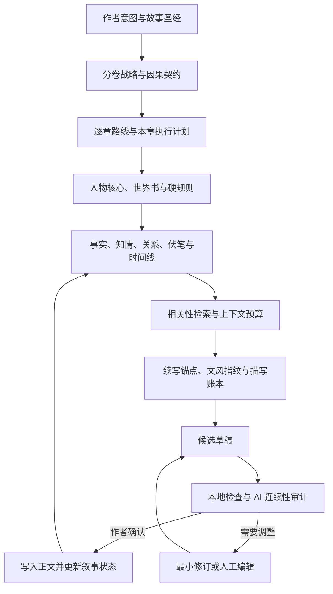

<div align="center">

# 砚火 · InkForge Local

### 为中文长篇小说而生的本地 AI 写作工作台

从一句灵感，到故事圣经、分卷规划、逐章创作、连续性审计与长期记忆——<br>
让本地模型真正参与一部长篇作品的完整生产，而不只是续写下一段文字。

[](https://github.com/star031104/inkforge-local)
[](https://www.python.org/)
[](https://fastapi.tiangolo.com/)
[](https://github.com/ggml-org/llama.cpp)
[](#测试与质量保障)

**本地优先 · 中文长篇 · 可恢复工作流 · 可追溯记忆 · 作者最终控制**

[快速开始](#快速开始) · [核心能力](#核心能力) · [工作流](#推荐创作工作流) · [技术架构](#技术架构) · [项目文档](#项目文档)

</div>

---

## 项目简介

**砚火**是一套面向中文小说作者的本地优先 AI 创作系统。它通过 llama.cpp 的 OpenAI 兼容接口连接本地 GGUF 模型，把长篇创作拆解为可检查、可编辑、可暂停、可恢复的专业流程。

它不会把整本小说粗暴地塞进一次提示词，也不会让模型悄悄覆盖手稿。作品方向、人物状态、世界规则、伏笔、章节计划和历史版本都以结构化数据留在本机；生成内容先进入候选草稿，只有作者确认后才写入正文并更新长期记忆。

> 砚火不是“替你按一下按钮写完一本书”，而是让 AI 在长篇创作中拥有可靠的规划、记忆、审计与恢复能力，同时始终保留作者的决定权。

## 为什么选择砚火

| 常见问题 | 砚火的解决方式 |
| --- | --- |
| 长篇写到后面人物失忆、设定漂移 | 可追溯事实、人物知情、关系、伏笔与事件时间线共同约束 |
| 大纲很宏大，拆到章节却反复做同一件事 | 分卷因果契约、12 类剧情岗位、状态维度轮换与跨章重复检查 |
| 本地小模型容易超时或输出残缺 JSON | 分段事务、流式闭合早停、检查点恢复与可编辑降级结果 |
| AI 草稿出现套话、复述、截断或现代术语 | 本地确定性检查 + AI 连续性审计 + 全稿级质量体检 |
| 自动生成中断后必须从头再来 | SQLite 持久化任务状态，可暂停、恢复并从首个问题点重建 |
| 担心作品或样文上传云端 | 默认仅连接本机 llama.cpp，项目数据保存在本地 SQLite |

## 核心能力

### 全书级规划

- **灵感孵化**：把一句人物、冲突或片段扩展成两套可比较的开书方案。
- **故事圣经**：建立主题命题、读者承诺、故事发动机、贯穿冲突与终局代价。
- **分卷蓝图**：按卷固定主要场域、时间跨度、人物选择、不可逆变化和新故事问题。
- **逐章因果路线**：以小批次拆章，检查目标、冲突、转折、章末变化及卷内推进职责。
- **一键创作全文**：从灵感开始，自动完成规划、拆章、正文、审计、修订与记忆回灌。

### 长期叙事记忆

- 永久人物核心与动态场景状态分离，临时衣着不会覆盖稳定外貌。
- 原子事实保存来源章节、正文证据、有效期、置信状态与替代关系。
- 独立维护人物知情账本、动态关系网、事件时间线与伏笔生命周期。
- 世界书支持关键词或正则触发、AND/NOT 条件、递归关联、作用域和 token 预算。
- 相关性检索包含类型配额和相似内容抑制，避免同类旧信息挤占上下文。

### 写作与文风控制

- 支持续写、按要求创作、重写选中内容、扩写选中内容。
- 续写时锚定原文末句和场景边界，降低复述、重开场景与凭空补史。
- 文风学习采用“风格卡 + 合法样文节选”的软学习方式，不修改模型权重。
- 根据当前场景的对话比例、句长、节奏和相关性动态选择文风示例。
- 逐章作者注只约束当前章节，长期硬规则与临时要求互不污染。

### 审计与质量系统

- 检查长度、元话语、Markdown、重复原文、循环措辞、AI 套话与疑似截断。
- 审计人物人格、声音、知识来源、关系、道具、伤势、位置、时间与世界规则。
- 识别跨章原句或段落复用、疲劳词、章节相似度和分卷阶段雷同。
- 历史题材可检查现代术语密度，降低语言时代错位。
- 审计建议可逐项选择并执行最小修订，不直接覆盖已确认正文。

### 本地可靠性与数据安全

- SQLite 使用 WAL 与写入等待保护，自动维护数据库备份。
- 每章在保存、接纳草稿和自动导演写入前保留独立快照。
- 完整项目可导出并重新导入为独立副本。
- 长任务绑定发起时的作品和章节，切换页面不会把结果串写到其他章节。
- 自动导演支持暂停、恢复、严格模式和无人值守质量债务模式。

## 长篇防跑偏机制

砚火通过十六层上下文与状态控制维持长篇一致性：



提示词预览会展示每个上下文区块的优先级、估算 token、命中的记忆及预算裁剪轨迹。完整设计见[叙事记忆与小说质量架构](NARRATIVE_MEMORY_ARCHITECTURE.md)。

## 快速开始

### 环境要求

- Windows 10 / 11
- Python 3.10 或更高版本
- [llama.cpp](https://github.com/ggml-org/llama.cpp) 的 `llama-server`
- 一个适合中文创作的 Instruct GGUF 模型

### 1. 启动本地模型

准备好 `llama-server.exe` 和 GGUF 模型后，在 PowerShell 中运行：

```powershell
llama-server.exe `
  -m D:\Models\your-model.gguf `
  --host 127.0.0.1 `
  --port 8080 `
  -c 32768 `
  -ngl 99
```

默认接口为 `http://127.0.0.1:8080/v1`。显存不足时降低 `-ngl`，内存或上下文不足时降低 `-c`。

### 2. 启动砚火

克隆仓库并进入项目目录：

```powershell
git clone https://github.com/star031104/inkforge-local.git
cd inkforge-local
.\run.ps1
```

首次运行会自动创建 `.venv` 并安装依赖。启动完成后访问：

**http://127.0.0.1:7860**

<details>
<summary><strong>手动安装与启动</strong></summary>

```powershell
py -3 -m venv .venv
.\.venv\Scripts\python.exe -m pip install -r requirements.txt
.\.venv\Scripts\python.exe -m uvicorn app.main:app --host 127.0.0.1 --port 7860
```

</details>

## 推荐创作工作流

### 专业分层创作

1. 在“灵感孵化”输入一句想法，从两套方案中选择更有潜力的方向。
2. 生成并审核故事圣经、人物卡、世界书、分卷契约与详细蓝图。
3. 逐卷生成章节因果路线，再批量建立或同步章节。
4. 为当前章节生成执行计划，明确开篇第一拍、场景因果拍和章末状态。
5. 生成候选草稿，执行质量检查和连续性审计。
6. 选择问题进行最小修订，确认后插入正文并更新长期记忆。
7. 定期运行项目体检，处理重复内容、线索债务和记忆来源问题。

### 全文自动导演

如果希望从一个灵感直接开始整本生产，可使用“一键创作全文”。系统会串行执行：

```text
灵感 → 故事骨架 → 人物卡与世界书 → 故事圣经
     → 分卷契约 → 逐卷蓝图 → 逐章路线
     → 本章计划 → 正文 → 审计 → 修订 → 记忆回灌
```

自动导演针对本地 8–12B 模型采用细粒度检查点。模型断开、持续超时或结构化输出无法闭合时会安全暂停；软质量问题则保留最佳完整候选、记录质量债务并按所选模式继续。重启应用后可从最近检查点恢复。

## 技术架构

```text
inkforge-local/
├─ app/
│  ├─ main.py                 FastAPI、业务接口与流式任务
│  ├─ db.py                   SQLite 存储、快照与恢复
│  ├─ llama_client.py         llama.cpp OpenAI 兼容客户端
│  ├─ prompts.py              世界书激活与分层提示词编排
│  ├─ planning.py             全书、分卷与章节规划
│  ├─ memory.py               长期记忆提取与相关性检索
│  ├─ lore.py                 世界书条件与递归关联
│  ├─ style_engine.py         文风统计与动态示例选择
│  ├─ quality.py              单章确定性质量检查
│  ├─ manuscript_quality.py   跨章与全稿级质量分析
│  └─ fallbacks.py            本地安全降级策略
├─ static/                    原生 Web 写作界面
├─ tests/                     API、规划、记忆与质量测试
├─ data/                      本地数据库与自动备份（不入库）
├─ requirements.txt
└─ run.ps1                    Windows 一键启动脚本
```

### 技术栈

| 层 | 技术 |
| --- | --- |
| Web API | FastAPI + Uvicorn |
| 数据模型 | Pydantic |
| 模型通信 | HTTPX + OpenAI 兼容流式接口 |
| 数据持久化 | SQLite（WAL） |
| 前端 | 原生 HTML / CSS / JavaScript |
| 测试 | Pytest |
| 推理后端 | llama.cpp / GGUF |

## 模型建议

优先选择上下文较长、中文能力好、指令遵循稳定的 Instruct GGUF：

- **7B / 8B**：适合轻量续写、灵感讨论和短场景。
- **12B / 14B**：规划、人物一致性和中文表达的综合平衡更好。
- **32B 及以上**：复杂人物关系、长场景与文风控制通常更稳定，但资源要求更高。

应用不绑定特定模型。实际速度和可用上下文取决于模型量化、硬件、`-ngl` 与 `-c` 配置。

## 数据存储与隐私

- 项目数据默认存储在本机 `data/inkforge.db`。
- 自动备份位于 `data/backups/`，默认轮换保留 12 份。
- 数据库、备份、日志和 SQLite 临时文件已通过 `.gitignore` 排除。
- 砚火默认只调用 `127.0.0.1:8080` 的本地接口，不要求云端 API Key。
- 导入样文前请确认你拥有相应使用权；文风学习用于抽取一般写作特征，不应复制原句或专有设定。

## 测试与质量保障

当前测试集覆盖 API 契约、自动导演、规划、世界书、提示词、长期记忆、叙事状态、质量检查、数据恢复和前端绑定。

```powershell
.\.venv\Scripts\python.exe -m pytest -q
```

当前基线：**103 tests passed**。

需要逐项验证界面、提示词、续写、记忆和导出时，请查看[完整测试流程与示例输入](TESTING_GUIDE.md)。

## 项目文档

| 文档 | 内容 |
| --- | --- |
| [叙事记忆与小说质量架构](NARRATIVE_MEMORY_ARCHITECTURE.md) | 十六层长篇控制、事实来源与状态模型 |
| [全稿质量架构](MANUSCRIPT_QUALITY_ARCHITECTURE.md) | 跨章重复、疲劳词、分卷推进与质量熔断 |
| [自动导演可靠性架构](RESILIENCE_ARCHITECTURE.md) | 故障分类、检查点、恢复与质量债务 |
| [完整测试指南](TESTING_GUIDE.md) | 功能验证流程、测试输入与验收方法 |
| [《诸子山河》创作框架](WARRING_STATES_NOVEL_FRAMEWORK.md) | 历史架空长篇的完整示例框架 |
| [秦策全稿重构执行稿](QINCE_MANUSCRIPT_REBUILD.md) | 84 章历史长篇的诊断与重构方案 |
| [专业审计报告](PROFESSIONAL_AUDIT.md) | 项目级质量审计记录 |

## 当前边界

- 文风学习属于 RAG / 提示词层的软学习，不是 LoRA 微调。
- token 数为本地估算，不同模型的实际分词结果会有差异。
- 连续性审计能够降低事实错误，但不能代替作者对关键设定的确认。
- 本地规则擅长发现可确定的机械问题，不能判断主题深度或文学价值。
- 本地小模型的规划质量高度依赖模型能力、量化方式、上下文长度和采样设置。

## 设计参考

项目在架构思路上参考了：

- [AI-Novel-Writing-Assistant](https://github.com/ExplosiveCoderflome/AI-Novel-Writing-Assistant) 的导演式整本生产流程
- [InkOS](https://github.com/Narcooo/inkos) 的规划—编排—写作—审计—状态更新链路
- [Long-Novel-GPT](https://github.com/MaoXiaoYuZ/Long-Novel-GPT) 的分级扩写与相关片段检索
- [SillyTavern World Info](https://docs.sillytavern.app/usage/core-concepts/worldinfo/) 的关键词世界信息机制

砚火是针对单个本地 llama.cpp 模型独立实现的轻量方案，没有复制上述项目的源代码。

---

<div align="center">

**让模型记住故事，让作者掌握方向。**

如果砚火对你的创作有所帮助，欢迎为项目点亮一个 ⭐。

</div>
