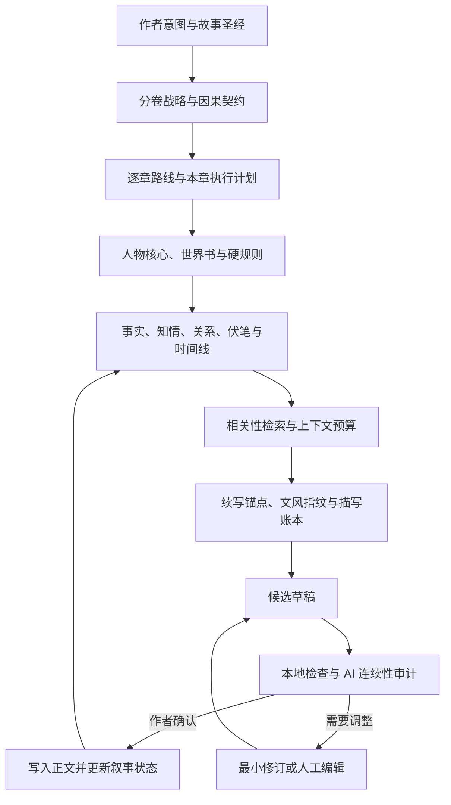

<div align="center">

# 砚火 · InkForge Local

### 为中文长篇小说而生的本地 AI 写作工作台

从一句灵感，到故事圣经、分卷规划、逐章创作、连续性审计与长期记忆——<br>
让本地模型真正参与一部长篇作品的完整生产，而不只是续写下一段文字。

[](https://github.com/star031104/inkforge-local)
[](https://github.com/star031104/inkforge-local/actions/workflows/tests.yml)
[](https://github.com/star031104/inkforge-local/releases/latest)
[](https://www.python.org/)
[](https://fastapi.tiangolo.com/)
[](#模型建议)

**中文长篇 · 同人 Canon Lock · 证据知识图谱 · 可恢复工作流 · 作者最终控制**

[下载安装](#下载安装) · [快速开始](#快速开始) · [核心能力](#核心能力) · [创作工作流](#推荐创作工作流) · [技术架构](#技术架构) · [开发验证](#开发验证)

</div>

---

## 项目简介

**砚火**是一套面向中文长篇与同人创作的 AI 写作工作台。你可以选择使用一个模型处理全部工作，也可以配置两个任意服务的模型：模型 1 主要负责正文、续写和修订，模型 2 主要负责故事设定、规划、审计和记忆提取。智谱、ModelScope、其他 OpenAI-Compatible 接口和本地 llama.cpp / GGUF 都可以自由组合。

它不会把整本小说粗暴地塞进一次提示词，也不会让模型悄悄覆盖手稿。作品方向、人物状态、世界规则、伏笔、章节计划和历史版本都以结构化数据留在本机；生成内容先进入候选草稿，只有作者确认后才写入正文并更新长期记忆。

> 砚火不是“替你按一下按钮写完一本书”，而是让 AI 在长篇创作中拥有可靠的规划、记忆、审计与恢复能力，同时始终保留作者的决定权。

## 项目状态

| 项目 | 当前状态 |
| --- | --- |
| 当前版本 | `0.33.2` |
| 支持系统 | Windows 10 / 11；源码模式同时支持 Linux |
| Python | 3.10–3.12；自动部署版无需预装 |
| 数据存储 | 本地 SQLite，作品与模型凭据分库保存 |
| 模型接口 | 智谱、ModelScope、本地 llama.cpp、任意 OpenAI-Compatible 服务 |
| 模型路由 | 一个模型统一处理，或两个模型按正文/规划任务自动分工 |
| 自动化测试 | Windows / Linux × Python 3.10 / 3.12 |
| API 兼容版本 | `50` |

## 下载安装

前往 [GitHub Releases](https://github.com/star031104/inkforge-local/releases/latest) 下载最新版。

| 发行方式 | 适合场景 | 使用方法 |
| --- | --- | --- |
| `InkForge-Deploy-0.33.2-win64.zip` | 推荐给普通 Windows 用户，下载体积小 | 解压后双击 `InkForgeLauncher.exe`，首次运行自动准备环境 |
| `InkForge` 便携目录 | 完全离线机器或需要固定运行环境 | 解压完整目录后运行 `InkForge.exe` |
| 源码运行 | 开发、调试、二次开发 | 克隆仓库后运行 `run.bat` 或 `run.ps1` |

> 首次自动部署需要联网下载 Python 和锁定依赖。下载完成后会复用本机缓存；作品、凭据、日志和备份不会写入程序安装目录。

## 为什么选择砚火

| 常见问题 | 砚火的解决方式 |
| --- | --- |
| 长篇写到后面人物失忆、设定漂移 | 可追溯事实、人物知情、关系、伏笔与事件时间线共同约束 |
| 大纲很宏大，拆到章节却反复做同一件事 | 分卷因果契约、可选叙事策略与跨章重复检查；保留经典十二岗位模式 |
| 本地小模型容易超时或输出残缺 JSON | 分段事务、流式闭合早停、检查点恢复与可编辑降级结果 |
| AI 草稿出现套话、复述、截断或现代术语 | 本地确定性检查 + AI 连续性审计 + 全稿级质量体检 |
| 自动生成中断后必须从头再来 | SQLite 持久化任务状态，可暂停、恢复并从首个问题点重建 |
| 深度规划和正文对模型要求不同 | 可配置两个模型自动分工，也可让一个模型处理全部任务 |
| 同人角色越写越 OOC | 原作资料库 + 人工核对 Canon Profile + 接受前 Canon Gate |
| 参考小说越学越像“复制” | 抽象风格指纹 + 多样文分析 + 长原句重合检测 |

## 核心能力

### 统一运行时与一键部署

- **统一应用入口**：源码、命令行、便携版和自动部署版共用同一套服务启动、日志、端口和健康检查逻辑。
- **双击自动部署**：独立启动器检测 Python 与依赖，必要时从官方固定地址下载并校验安装，完成后自动打开工作台。
- **隔离运行环境**：依赖环境同时绑定应用版本和依赖文件指纹，升级不会污染旧环境；缓存完整时可以离线复用。
- **发布契约检查**：应用、前端资源、启动器、安装脚本和文档版本必须一致，CI 与本机构建都会阻止错配发布。
- **周期数据库备份**：备份任务跟随应用生命周期运行，与具体保存按钮解耦；自动和手动备份分别轮换。
- **正式项目元数据**：`pyproject.toml` 统一声明构建后端、Python 版本、运行依赖、开发依赖和 `inkforge` 命令入口。

### 专业工程与作者工作台

- **清晰分层**：HTTP 请求契约与路由位于 `app/api`，纯故事规则位于 `app/domain`，业务用例位于 `app/services`，SQLite 与检索实现位于 `app/infrastructure`，运行配置集中在 `app/core`。
- **可组合路由**：作品生命周期、系统状态、模型发现、资料研究、专业工作台和场景工作台分别注册；入口文件负责组合，不再拥有这些接口的实现。
- **前端职责拆分**：项目状态、生成、设置、规划、资料、审校、治理、自动导演、场景工具和启动绑定均为独立脚本；样式也按基础、工作区、模型路由和写作工具拆分。
- **兼容迁移**：HTTP 路径、项目 JSON 和 SQLite 数据格式保持兼容；原有 `app.main` 入口和关键测试导入继续有效。

- **章节时间边界**：正文提示词、章节规划和审计按当前章之前的证据构建记忆视图；摘要、动态人物状态、关系和事件不再直接使用全书最终状态。作者预先设定的世界观和大纲仍可作为规划资料。
- **修改后的记忆重建**：已结算正文变更会标记受影响章节及后文记忆失效，隔离旧事实并提示按顺序重新结算。正文保留；新结算与正文哈希一致时只使后续章节失效。
- **证据门禁**：高、中严重度问题缺乏有效证据时保留“待复核”，不会因机械检查高分而自动通过。规则分、连续性复核状态和文学判断分开表达。
- **保存冲突保护**：界面与专业工作台写入必须携带作品版本；数据库更新原子比较版本。冲突返回明确提示，无修改保存不制造新版本。
- **场景工作台**：在正文上方新建场景计划，或先选中正文再绑定场景；支持视角、时空、进入状态、目标、阻力、变化、退出状态和依赖事实。卡片编辑不修改正文，单场生成仍进入候选稿。原文变更或绑定重叠时要求重新定位。
- **叙事策略与作者偏好**：在“规划”中选择因果与人物、悬疑、关系、冒险、观察、自定义或经典十二岗位。偏好先保存为待确认项，明确启用后才进入正文生成上下文，可随时停用；允许保存修改前后实例供作者复核。
- **候选稿取舍**：重写、扩写支持按变化片段选择采用或保留原文，先组合新候选稿，再通过原有插入流程写入正文；变化后旧审计结果失效。
- **Skill 适用性**：任务、题材和排除条件共同决定适用性，手动选择也遵守边界；提示词预览标记注入与裁剪情况。Skill 是受约束的写作方法，不是可执行代理。
- **本地调用记录**：查看最近调用的模型、任务、重试、耗时、结束原因和 token 来源；仅存统计，不存正文、提示词、接口地址和密钥。无供应商用量时显示估算，不虚构费用。
- **候选评测**：并排比较两份稿件的机械问题、句长与对白占比，可导出记录。此功能不调用模型、不自动选稿，也不声称能评判文学质量。
- **最终请求预算检查**：发送模型前核对包含稳定前缀的完整输入与输出预留，超限先提示调整。仍使用估算，实际分词由模型决定。
- **增量检索索引**：仅更新变化的检索文档；重建索引时剔除失效与孤立的派生事实。作品 JSON 仍是事实源。

旧作品缺少人物初始状态或历史证据时，无法可靠还原的动态字段会暂时留空；请核对后补充设定，并从提示的失效章节顺序重建记忆。

### 全书级规划

- **灵感孵化**：把一句人物、冲突或片段扩展成两套可比较的开书方案。
- **故事圣经**：建立主题命题、读者承诺、故事发动机、贯穿冲突与终局代价。
- **分卷蓝图**：按卷固定主要场域、时间跨度、人物选择、不可逆变化和新故事问题。
- **逐章因果路线**：以小批次拆章，检查目标、冲突、转折、章末变化及卷内推进职责。
- **一键创作全文**：从灵感开始，自动完成规划、拆章、正文、审计、修订与记忆回灌。

### 长期叙事记忆

- 章节正文先持久化为 `settlement_pending`，再提取、核验和提交；失败只会进入 `state_degraded`，不会丢正文。
- 每次验收绑定正文 SHA-256，同一正文重复点击不会制造重复事实，正文改变后旧记忆提交会被拒绝。
- 永久人物核心与动态场景状态分离，临时衣着不会覆盖稳定外貌。
- 原子事实、人物状态、知情、关系、时间线和伏笔更新必须附正文连续证据，并在本地逐字核验后才能升级为权威状态。
- 模型返回的全书摘要只保存为候选；实际滚动进展由已接纳章节摘要确定性汇编，不能被单次模型响应整体覆盖。
- 独立维护人物知情账本、动态关系网、事件时间线与伏笔生命周期。
- 世界书支持关键词或正则触发、AND/NOT 条件、递归关联、作用域和 token 预算。
- 相关性检索把结构化状态与 SQLite FTS5 旧正文片段混合排序，并使用类型配额和相似内容抑制，避免同类旧信息挤占上下文。
- 检索查询在数据库层排除当前章与未来章；FTS 索引属于可重建投影，项目 JSON 始终是唯一事实源。
- 作者层真相、读者已见信息和人物有证据知情分别编译；重写早期章节时不会注入本章或后期知情账本。

### 写作与文风控制

- 支持续写、按要求创作、重写选中内容、扩写选中内容。
- 续写、新章、局部改写和整章修订采用不同上下文配方；局部改写不会再加载无关的全书战略。
- 创作自由度可选严格、平衡或探索；三种模式都保护权威事实与人物知情边界。
- 续写时锚定原文末句和场景边界，降低复述、重开场景与凭空补史。
- 文风学习采用“风格卡 + 合法样文节选”的软学习方式，不修改模型权重。
- 根据当前场景的对话比例、句长、节奏和相关性动态选择文风示例。

### AI 自动创作与精修

- **一键创作全文**：从一句灵感开始，自动完成开书、人物与世界设定、全书规划、分卷拆章、逐章正文、审校修订和记忆回灌。
- **AI 自动精修**：可以只处理精修队列，也可以检查全部已有正文；逐章执行审校、整章修订、重新审校、硬契约扫描、正文锁定和记忆更新。
- **多轮自动修订**：每章可自动尝试 2–4 次，达到目标质量分后才接纳；不达标的候选稿保存在检查点中，不覆盖原正文。
- **后台检查点**：自动创作和自动精修都可暂停、恢复；关闭浏览器后任务仍由本地服务继续执行。
- **人工控制**：单章审校结果支持“一键修订全部问题”，也可以只选择部分问题修订并随时撤销。
- 逐章作者注只约束当前章节，长期硬规则与临时要求互不污染。
- 写作 Skills 分为内置只读、个人跨项目和项目随书三层，支持始终、关键词自动和手动激活。
- Skill 只能提供受长度限制的提示词方法，不能执行命令、调用工具、访问文件或联网，也不能覆盖事实与知情边界。

### 原作同人角色与证据知识图谱

- **Canon Lock**：为时崎狂三、花火、上杉绘梨衣等原作角色保存原作、时间节点、人格、价值观、能力限制、语言/行为/情绪模式和禁止 OOC 清单。
- AI 可根据上传的原作资料生成“待核对档案”，**只有人工确认后才成为最高级角色硬约束**。
- 正文接受前可强制运行 Canon Gate；明显 OOC、无铺垫关系突变或高风险样文复刻会阻止入稿。
- **知识层不是把共现当关系**：结构化事实和关系保留来源/证据，候选推断不会自动升级为真相。
- 可变状态支持 superseded：角色移动后，旧“当前地点”不会继续和新地点同时注入。
- 知识图谱是可重建的检索投影，人物卡、世界书和已接受正文仍是事实源。

### 专业工作台：考据、事件溯源与不可覆盖定稿

- 联网检索与大模型完全解耦，可选免密钥 Bing RSS / Wikipedia、SearXNG 或 Brave Search；不依赖 Grok，也不需要浏览器接管。
- 来源按 S/A/B/C/D 分级；人物事实拆成原子结论，证据必须能在保存的来源正文中逐字定位，推断与原作明确内容分开保存。
- 角色档案由已批准结论汇总，保留来源、冲突和待人工确认状态，不让一次模型回答直接成为正典。
- 人物变化和关系变化以事件日志保存，并能确定性重建当前状态；信任、距离、立场和信息差不再只靠滚动摘要维持。
- 角色声纹实验室保存有出处的正反样本和句长、对白率等统计约束，只学习规律，不复制原句。
- 候选稿、审校报告、修订提案和最终定稿分别留档；最终定稿绑定内容哈希与权威资料版本，同一候选稿不能被二次覆盖。
- 人物卡、世界书、规划、风格或考据资料改变时自动提高权威版本，并把依赖旧版本的派生资产标为过期。
- 模型路由保持简单的一模型 / 两模型结构；两模型模式按写作类与规划审校类任务自动分工。

### 多文件参考资料库

- 支持 TXT / MD / DOCX / EPUB / PDF / HTML 等文本资料。
- 资料分类为：**文风样文 / 原作正典 / 世界背景 / 研究资料**。
- 文风分析只消费“文风样文”，人物正典分析只消费“原作正典”，避免职责混淆。
- 支持多篇样文聚合分析，并对候选正文做长片段精确重合检查。

### 审计与质量系统

- 检查长度、元话语、Markdown、重复原文、循环措辞、AI 套话与疑似截断。
- 审计人物人格、声音、知识来源、关系、道具、伤势、位置、时间与世界规则。
- 识别跨章原句或段落复用、疲劳词、章节相似度和分卷阶段雷同。
- 历史题材可检查现代术语密度，降低语言时代错位。
- 审计建议可逐项选择并执行最小修订，不直接覆盖已确认正文。

### 本地可靠性与数据安全

- SQLite 使用 WAL 与写入等待保护，自动维护数据库备份。
- 章节验收采用可审计提交状态；耗时提取期间会从服务器最新项目合并，避免覆盖其他章节的并行编辑。
- 每章在保存、接纳草稿和自动导演写入前保留独立快照。
- 完整项目可导出并重新导入为独立副本。
- 长任务绑定发起时的作品和章节，切换页面不会把结果串写到其他章节。
- 保存使用服务器版本校验；另一个窗口或后台任务更新作品后，旧窗口只能导出副本或重新载入，不能静默覆盖新版本。
- 草稿记录生成时正文与选区；正文在生成期间发生变化时会停止应用，并提供原文与候选稿对比。
- 自动导演支持暂停、恢复、严格模式和无人值守质量债务模式。
- 每次正文生成自动冻结实际模型消息、检索来源、Skill、预算裁剪和提示词 SHA-256；可在界面审计并用新的模型配置回放。
- 快照不会保存 Provider 凭据，凭据字段和疑似 API Key 在入库前统一脱敏。

## 长篇防跑偏机制

砚火通过十六层上下文与状态控制维持长篇一致性：



提示词预览会展示每个上下文区块的优先级、估算 token、FTS/词法记忆来源、激活的写作 Skills 及预算裁剪轨迹，并可冻结为可审计快照。

## 快速开始

### 环境要求

- Windows 10 / 11
- 至少一个可用的模型 API Key，或已经启动的本地 llama.cpp 服务

使用自动部署版不需要预装 Python。源码开发需要 Python 3.10 或更高版本。

### 1. 启动砚火

普通使用直接解压 `InkForge-Deploy-0.33.2-win64.zip`，双击
`InkForgeLauncher.exe`。启动器会检测运行环境；缺失时自动下载经过固定哈希校验的
Python 和项目依赖，完成后打开工作台。运行环境、日志与作品数据位于当前用户的
`%LOCALAPPDATA%\InkForge`，更新程序目录不会覆盖作品。

源码开发方式：

```powershell
git clone https://github.com/star031104/inkforge-local.git
cd inkforge-local
.\run.bat
```

访问 **http://127.0.0.1:7860**。首次启动会自动创建虚拟环境并安装依赖。`run.bat` 只对本次子进程使用 PowerShell `ExecutionPolicy Bypass`，不会永久修改系统执行策略。

### 2. 配置一个或两个模型

打开右上角 **模型设置**，直接选择 **一个模型** 或 **两个模型**。每个模型都可以独立选择服务、API 地址、模型 ID 和 Key。

```text
模型 1：主要处理正文、续写和修订
模型 2：主要处理规划、审计和信息提取
```

选择两个模型时，如果两边都填写了 Key，系统会启用两个模型并自动分工；如果只填写一边的 Key，全部任务会自动交给这一边。选择本地 llama.cpp 时无需填写 Key。

> 推荐通过环境变量提供 API Key，使密钥不进入项目数据库；如果在界面中填写，密钥只保存在本机数据库，导出项目 JSON 时会自动移除。

### 3. 使用兼容接口

在任意模型卡片中选择 “OpenAI-Compatible”，填写供应商提供的地址、模型名和 Key。该入口不附加特定厂商参数。

```text
API URL: 供应商的 OpenAI 兼容地址
Model:   供应商的模型 ID
API Key: 供应商 API Key
```

智谱 Key 可通过 `ZHIPU_API_KEY` 或 `INKFORGE_ZHIPU_API_KEY` 提供；ModelScope Token 可通过 `MODELSCOPE_API_KEY` 或 `INKFORGE_MODELSCOPE_API_KEY` 提供；其他兼容接口可使用 `INKFORGE_OPENAI_COMPAT_API_KEY`。小说长期记忆始终由本机 InkForge 状态库管理。

### 4. 后续切换到本地 llama.cpp

先启动本地模型，例如：

```powershell
llama-server.exe `
  -m D:\Models\your-model.gguf `
  --host 127.0.0.1 `
  --port 8080 `
  -c 32768 `
  -ngl 99
```

然后在模型设置选择 `本地 llama.cpp`：

```text
API URL: http://127.0.0.1:8080/v1
Model:   local-model（或服务实际模型 ID）
API Key: 可留空
Thinking: 关闭
```

无需重新建立项目，原有角色、世界观、样文、知识图谱和章节记忆全部继续使用。

## 推荐创作工作流

### 专业分层创作

1. 在“灵感孵化”输入一句想法，从两套方案中选择更有潜力的方向。
2. 生成并审核故事圣经、人物卡、世界书、分卷契约与详细蓝图。
3. 逐卷生成章节因果路线，再批量建立或同步章节。
4. 为当前章节生成执行计划，明确开篇第一拍、场景因果拍和章末状态。
5. 生成候选草稿，执行质量检查和连续性审计。
6. 选择问题进行最小修订，确认后插入正文并更新长期记忆。
7. 定期运行项目体检，处理重复内容、线索债务和记忆来源问题。

### 全文自动导演

如果希望从一个灵感直接开始整本生产，可使用“一键创作全文”。系统会串行执行：

```text
灵感 → 故事骨架 → 人物卡与世界书 → 故事圣经
     → 分卷契约 → 逐卷蓝图 → 逐章路线
     → 本章计划 → 正文 → 审计 → 修订 → 记忆回灌
```

自动导演针对本地 8–12B 模型采用细粒度检查点。模型断开、持续超时或结构化输出无法闭合时会安全暂停；软质量问题则保留最佳完整候选、记录质量债务并按所选模式继续。重启应用后可从最近检查点恢复。

## 技术架构

```text
inkforge-local/
├─ app/
│  ├─ main.py                 应用组合、章节与规划工作流
│  ├─ entrypoints/            源码、桌面版和部署版共用的进程入口
│  ├─ api/                    请求契约与按业务区域拆分的 HTTP 路由
│  ├─ core/                   版本、运行路径与无副作用基础工具
│  ├─ domain/                 项目迁移、规划、路线与正文纯规则
│  ├─ services/               结构化输出、记忆结算、审校与自动导演运行时
│  ├─ infrastructure/         检索、凭据、进程锁与定时备份
│  ├─ db.py                   SQLite 仓储、事务、快照与恢复
│  ├─ llama_client.py         OpenAI-Compatible HTTP / SSE 客户端
│  ├─ providers.py            一模型 / 两模型路由与供应商参数隔离
│  ├─ professional_api.py     专业工作台的考据、事件、声纹与编辑流程接口
│  ├─ story_systems.py        权威版本、证据结论、事件重建与不可变定稿核心
│  ├─ prompts.py              世界书、Canon、知识层与分层提示词编排
│  ├─ prompt_policy.py        任务专用上下文配方与创作自由度策略
│  ├─ project_service.py      项目版本校验与安全保存服务
│  ├─ knowledge.py            实体 / 事实 / 关系 / 可变状态知识层
│  ├─ canon.py                同人原作 Canon Profile 与 OOC 审校规则
│  ├─ references.py           多文件参考资料检索与样文防复刻
│  ├─ file_parsing.py         TXT/MD/DOCX/EPUB/PDF/HTML 文本解析
│  ├─ planning.py             全书、分卷与章节规划
│  ├─ memory.py               长期记忆提取与相关性检索
│  ├─ memory_integrity.py     正文哈希、验收提交、降级与确定性滚动摘要
│  ├─ writing_skills.py       只读/个人/项目写作 Skills 与安全激活
│  ├─ lore.py                 世界书条件与递归关联
│  ├─ style_engine.py         文风统计与动态示例选择
│  ├─ quality.py              单章确定性质量检查
│  ├─ manuscript_quality.py   跨章与全稿级质量分析
│  └─ fallbacks.py            本地安全降级策略
├─ static/
│  ├─ js/core/               项目、生成与窗口基础
│  ├─ js/features/           规划、资料、审校、治理与自动导演
│  ├─ css/                   工作区、模型路由与写作工具样式
│  └─ app.js                 共享状态与兼容基础
├─ docs/                      架构边界与开发验证手册
├─ scripts/                   启动器、发布构建、离线评测与工程检查
├─ tests/                     工作流、可靠性、传输与架构测试
├─ data/                      本地数据库与自动备份（不入库）
├─ requirements.txt
├─ pyproject.toml             项目元数据、依赖、命令入口和工具配置
├─ run.bat                    Windows 源码启动入口
└─ run.ps1                    PowerShell 启动脚本
```

### 技术栈

| 层 | 技术 |
| --- | --- |
| Web API | FastAPI + Uvicorn |
| 数据模型 | Pydantic |
| 模型通信 | HTTPX + OpenAI 兼容流式接口 |
| 数据持久化 | SQLite（WAL） |
| 前端 | 原生 HTML / CSS / JavaScript |
| 推理后端 | 智谱 / ModelScope / llama.cpp / 任意 OpenAI-Compatible 服务 |

## 模型建议

砚火不绑定特定模型，Provider 层允许同一个项目在云端 API 与本地推理之间切换：

- **ModelScope 模型**：可作为模型 1 或模型 2，按模型能力选择写作或结构化任务。
- **智谱模型**：可作为模型 1 或模型 2，模型 ID 由用户自行填写和调整。
- **其他 OpenAI-Compatible 服务**：手动填写接口地址与模型 ID，使用通用请求参数。
- **本地 7B / 8B GGUF**：适合轻量续写、灵感讨论和短场景，对显存要求较低。
- **本地 12B / 14B GGUF**：规划、人物一致性和中文表达的综合平衡更好。
- **本地 32B 及以上 GGUF**：复杂人物关系、长场景与文风控制通常更稳定，但资源要求更高。

实际效果取决于模型能力、上下文长度、采样设置，以及本地量化、显存卸载参数。无论切换哪种 Provider，项目中的人物、世界观、Canon、知识图谱和章节记忆均保持不变。

## 数据存储与隐私

- 项目数据默认存储在本机 `data/inkforge.db`。
- API Key 存储在独立的 `data/inkforge-secrets.db`，不会进入作品 JSON、历史版本或数据库备份；旧作品中的 Key 会在启动时自动迁移。
- 自动备份位于 `data/backups/`，应用启动后每小时检查并独立轮换保留 24 份；手动备份默认保留 12 份。
- “导出 → 备份恢复中心”可以校验备份完整性、预览其中作品并恢复；恢复前会创建当前数据库安全快照，任何恢复异常都会自动回滚。
- 数据库、备份、日志和 SQLite 临时文件已通过 `.gitignore` 排除。
- 模型设置保存一模型或两模型的服务、地址和模型 ID；凭据由独立本地凭据库管理，两模型模式会按实际填写的 Key 自动启用或回退。
- 导出完整项目 JSON 时会自动清除全部模型密钥，避免把云端密钥带入备份文件。
- 导入样文前请确认你拥有相应使用权；文风学习用于抽取一般写作特征，不应复制原句或专有设定。

## 发布说明

仓库包含运行源码、静态资源、依赖、启动脚本、自动化测试和可复现的评测/基准脚本。测试报告、截图、临时数据库和本机基准结果不纳入版本控制。

## 开发验证

在项目虚拟环境中运行：

```powershell
python -m pip install -r requirements-dev.txt
python -m ruff check app tests scripts
python -m pytest -q
python scripts/evaluate.py
python scripts/benchmark.py
python scripts/check_static.py
```

测试使用临时数据库，不读取作者作品。离线评测同时覆盖正文机械问题与版本化提示词的结构、事实边界、未来信息隔离和局部改写尺度；结果写入 `output/evaluation.json`。基准使用 10 万、50 万和 100 万字合成作品，结果写入 `output/benchmark.json`，只能反映运行机器上的保存开销，不能代表真实模型效果。

开发服务可通过 `INKFORGE_DB_PATH` 指向独立数据库，并可用 `INKFORGE_SECRET_PATH`、`INKFORGE_BACKUP_PATH` 指定隔离凭据库和备份目录；不设置时继续使用原有作品库。调用统计使用同目录的独立 `*-telemetry.db`，最多保留 5000 条记录。CI 配置覆盖 Windows / Linux、Python 3.10 / 3.12，并强制执行 Ruff；远端执行结果以 CI 实际运行记录为准。

作品数据库使用 SQLite 结构版本。旧库第一次打开前会在 `data/schema-backups` 留下原始副本，再执行幂等迁移；高于当前程序支持版本的数据库和备份会被拒绝。应用同时使用作品库独占锁和导演任务租约，防止两个进程同时写作或误判仍在运行的后台任务。

模型 Key 保存在独立凭据库并加密写盘：Windows 使用当前用户的 DPAPI，其他系统使用权限受限的本机随机密钥。旧版明文凭据会在第一次启动时自动转换。Key 仍不会进入项目历史、作品备份或 JSON 导出。

备份恢复中心可以直接设置备份目录并检查可写性、磁盘位置和最近备份。长期作品建议改到移动硬盘或同步目录。源码启动在依赖或数据库代码变化前会自动创建 `data/upgrade-backups` 回滚副本。

如果升级后必须回到升级前的作品库，先关闭砚火，运行 `python scripts/rollback_upgrade.py --list` 查看副本，再使用 `python scripts/rollback_upgrade.py --backup <完整路径> --confirm RESTORE`。回滚前仍会保存当前数据库，校验失败会自动恢复。

Windows 发布包可运行 `powershell -ExecutionPolicy Bypass -File scripts/build_windows.ps1` 构建。脚本生成自带运行环境的便携目录；检测到 Inno Setup 时继续生成安装程序。打包版把作品数据放在当前用户的 `%LOCALAPPDATA%\InkForge`，升级和卸载不会把作品写进安装目录。

自动部署版运行 `powershell -ExecutionPolicy Bypass -File scripts/build_launcher.ps1` 构建。产物位于 `dist/InkForge-Deploy`，同时生成可直接分发的 ZIP。启动器自身不依赖项目第三方包；它只从 Python 官方固定地址下载安装器，先校验 SHA-256，再建立按版本和依赖指纹隔离的环境。已有完整缓存时可离线启动。

发布前的真实模型验收使用完全隔离的数据库，支持单模型、双模型、10～30 章连续创作以及服务强制中断后的检查点恢复：

```powershell
# Key 只通过当前终端环境传入，不会进入验收报告
$env:ZHIPU_API_KEY = "你的 Key"
python scripts/acceptance_real_model.py --routing single --preflight-only
python scripts/acceptance_real_model.py --routing single --chapters 10

# 双模型验收也可显式提供两个临时 Key
$env:INKFORGE_ACCEPT_PRIMARY_PROVIDER = "zhipu"
$env:INKFORGE_ACCEPT_PRIMARY_KEY = "主模型 Key"
$env:INKFORGE_ACCEPT_SECONDARY_PROVIDER = "modelscope"
$env:INKFORGE_ACCEPT_SECONDARY_KEY = "辅助模型 Key"
python scripts/acceptance_real_model.py --routing dual --chapters 10

# 正式发布要求同一报告包含单模型、双模型、至少 10 章与重启恢复
python scripts/acceptance_real_model.py --routing both --chapters 10
python scripts/check_release_acceptance.py output/real-model-acceptance/<run-id>/report.json
```

运行器会启动隔离服务，在第一章完成后强制终止服务，再重启并验证任务转为可恢复状态，随后继续写完整本。报告、隔离数据库与服务日志写入 `output/real-model-acceptance/`；报告会自动脱敏。真实调用可能产生模型费用。

文学表现仍需要固定题材、相同上下文与预算下的模型对照和作者盲评；自动验收负责检查工程链路、恢复能力、重复正文、章节锁定和记忆结算。

## 常见问题

<details>
<summary><strong>双击启动器后第一次打开为什么需要较长时间？</strong></summary>

自动部署版会检查 Python、创建与当前版本隔离的虚拟环境，并安装锁定依赖。之后只要版本和依赖指纹没有变化，就会直接复用已有环境。
</details>

<details>
<summary><strong>关闭浏览器后，自动创作会停止吗？</strong></summary>

不会。浏览器只是本地工作台界面，自动导演任务运行在本地服务中。重新打开工作台后可查看进度、暂停任务或从检查点继续。
</details>

<details>
<summary><strong>双模型模式是否必须填写两个 Key？</strong></summary>

不必须。两个模型都可用时，系统按正文与规划审校任务自动分工；只有一个模型具备有效 Key 时，所有任务自动回退到可用模型。本地 llama.cpp 不要求 Key。
</details>

<details>
<summary><strong>升级或重新解压会不会删除小说？</strong></summary>

不会。发布版把作品数据库、凭据、日志和备份保存到当前用户的 `%LOCALAPPDATA%\InkForge`。恢复数据库前还会创建安全快照并执行完整性校验。
</details>

<details>
<summary><strong>为什么 AI 生成后没有直接覆盖正文？</strong></summary>

生成内容默认进入候选稿。只有作者明确接纳后才写入正文，并触发章节版本、连续性状态和长期记忆更新，以免一次异常模型输出破坏已确认手稿。
</details>

## 参与开发

1. Fork 仓库并从 `main` 创建功能分支。
2. 依照 [架构边界](docs/architecture.md) 放置领域规则、服务、基础设施和 HTTP 代码。
3. 为行为变化补充有意义的测试，并运行本文“开发验证”中的检查。
4. 提交 Pull Request，说明具体问题、最终行为和验证结果。

更完整的本地环境、真实模型验收、版本约束和发布流程参见 [开发与验证手册](docs/development.md)。

## 当前边界

- 文风学习属于 RAG / 提示词层的软学习，不是 LoRA 微调。
- token 数为本地估算，不同模型的实际分词结果会有差异。
- 连续性审计能够降低事实错误，但不能代替作者对关键设定的确认。
- 本地规则擅长发现可确定的机械问题，不能判断主题深度或文学价值。
- 本地小模型的规划质量高度依赖模型能力、量化方式、上下文长度和采样设置。

## 设计参考

项目在架构思路上重点研究了：

- [Storydex](https://github.com/TensorHub-ORG/Storydex) 的事实源 / WIKI / 知识图谱分层、证据关系和活跃实体上下文；
- [InkOS](https://github.com/logep/inkos) 的写—审—改闭环、真相文件和风格指纹；
- [Ai-Novel](https://github.com/inliver233/Ai-Novel) 的结构化对象与模型配置解耦；
- [NovelClaw](https://github.com/iLearn-Lab/NovelClaw) 的长期写作工作区和可检查记忆面板；
- [SillyTavern World Info](https://docs.sillytavern.app/usage/core-concepts/worldinfo/) 的关键词世界信息机制。

知识层、Canon Lock 与 Provider 层均为 InkForge 独立实现，没有复制上述项目的源代码。

---

<div align="center">

**让模型记住故事，让作者掌握方向。**

如果砚火对你的创作有所帮助，欢迎为项目点亮一个 ⭐。

</div>
